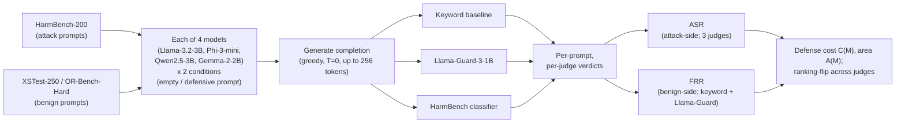

# Small Models, Same Rules: A Joint Attack-Success and False-Refusal Audit of Sub-4B Open LLMs Under a Single Defensive System Prompt

**Author.** shmitt@microsoft.com, Microsoft Responsible AI.

*Affiliation note.* This paper reports an independent comparative audit conducted by a Responsible AI practitioner at Microsoft. No internal or proprietary Microsoft models, datasets, evaluation tooling, or deployment systems were used. All target models, judges, and benchmark prompts are drawn from publicly released artifacts at pinned revisions.

---

## Abstract

Small open-weight chat models with under four billion parameters — Llama-3.2-3B-Instruct, Phi-3-mini, Qwen2.5-3B-Instruct, and Gemma-2-2B-it — increasingly run on laptops, phones, and offline ("air-gapped") systems: exactly the settings where a deployer cannot bolt on the extra safety machinery (a separate filter model, modified decoding, or retraining) that most published defenses assume. Yet the jailbreak-evaluation literature (HarmBench, JailbreakBench, StrongREJECT) focuses on larger (7B-and-up) and closed models, reports attack-success rate (ASR — how often a harmful request gets answered) and false-refusal rate (FRR — how often a safe request is wrongly refused) on different model sets, and rarely tests the one defense every deployer can actually apply: a single instruction written into the system prompt. We present a reproducible audit, runnable on one consumer GPU, that closes three gaps together. (1) We measure both attack success and false refusal on the same four models under the same defensive prompt (ASR on HarmBench-200 plus ten pre-published Greedy Coordinate Gradient (GCG) attack suffixes; FRR on XSTest-250 and OR-Bench-Hard). (2) We check every attack-success number against three independent automatic judges — a fine-tuned HarmBench classifier, Llama-Guard-3-1B, and a deliberately weak keyword detector — so that no single judge decides the ranking. (3) We measure what the defensive prompt costs: the extra false refusals it causes per unit of attack success it removes. All rates carry Wilson 95% confidence intervals, differences use a 1,000-sample paired bootstrap, and cross-judge ranking stability is tested with Kendall's tau (a rank-correlation measure). The grid runs in about 12 GPU-hours on a 16 GB consumer GPU (~18 with ablations), with a documented CPU/Ollama fallback. We pre-register three hypotheses before any run: (H1) the four models' safety ranking is not stable across judges; (H2) the defensive prompt reduces attack success on all four models, but the false-refusal cost varies by more than a factor of two between them; (H3) some apparent robustness to encoded prompts reflects the small model's limited ability to decode them rather than stronger alignment. We report each in Section 6. We propose no new attack or defense; every prompt is previously published, no harmful completion is reproduced, and we release only aggregate statistics and judge labels.

**Keywords.** jailbreak robustness; sub-4B open language models; attack success rate (ASR); false refusal rate (FRR); over-refusal; defensive system prompts; LLM safety evaluation; judge triangulation; pre-registration; Responsible AI; on-device deployment.

---

## 1. Introduction

Open instruction-tuned language models under four billion parameters (*sub-4B* for short) are now the substrate of on-device assistants, laptop inference stacks (the software that runs the model locally), and air-gapped (network-isolated) enterprise pilots. Llama-3.2-3B-Instruct [@grattafiori2024llama3], Phi-3-mini [@abdin2024phi3], Qwen2.5-3B-Instruct [@yang2024qwen25], and Gemma-2-2B-it [@riviere2024gemma2] ship inside Apple Intelligence-adjacent stacks, Ollama and llama.cpp deployments, mobile chat apps, and Responsible AI pilots that cannot route to a hosted API — exactly the contexts with the least defensive infrastructure. A classifier auxiliary (a second model that screens inputs and outputs) cannot be added when the device vendor fixes the inference stack. A decoding-time intervention such as SafeDecoding [@xu2024safedecoding], which alters how tokens are sampled, cannot be retrofitted into a closed Ollama binary. A representation-engineering layer such as Circuit Breakers [@zou2024circuitbreakers], which edits a model's internal activations, needs fine-tuning access that air-gapped pilots typically lack. The one intervention every deployer can apply is a natural-language defensive system prompt, in the spirit of the self-reminder work of Xie et al. [@xie2023selfreminder] and the goal-prioritization work of Zhang et al. [@zhang2024goalpriority].

The published jailbreak-evaluation literature has developed in the opposite direction. HarmBench [@mazeika2024harmbench], JailbreakBench [@chao2024jailbreakbench], and StrongREJECT [@souly2024strongreject] concentrate on 7B-and-larger open models and frontier closed models. XSTest [@rottger2024xstest], OR-Bench [@cui2024orbench], and PHTest [@an2024phtest] measure false-refusal rate, but rarely on the systems for which attack-success rate is reported. The defense literature favors techniques — SmoothLLM [@robey2023smoothllm], RPO, circuit breakers, SafeDecoding, Llama-Guard pipelines [@inan2023llamaguard] — that assume an inference stack most practitioners cannot modify. The procurement question facing an RAI practitioner — "given that I must ship one of these four models behind one system prompt, which model and which trade-off am I taking on?" — has no published answer.

This paper asks that question and answers it under a unified protocol. For each of the four target sub-4B open models, we measure attack-success rate on HarmBench standard behaviors and false-refusal rate on XSTest-250 and OR-Bench-Hard, both with and without a ~60-word defensive system prompt, under three independent judges, reporting the safety ranking under each. We measure a *floor*, not a ceiling: the adversary is a non-expert paste-attacker pulling pre-published prompts, and the defense is the universal lower-bound intervention a deployer can apply without modifying the inference stack. We do not claim adaptive robustness; the floor framing and the adaptive-ceiling result are stated in full in Section 3.7.

Three under-served gaps motivate the contribution. First, there is no head-to-head sub-4B safety comparison under a common protocol. Published comparisons change only one thing at a time: some fix the attacks and compare defenses [@xie2023selfreminder], some fix the defense and compare attacks [@mazeika2024harmbench], and some fix the threat model and compare over-refusal categories [@cui2024orbench]. We instead fix the attacks, the defense, and the threat model, and compare the four models. Second, ASR and FRR are typically reported on separate model sets, leaving the practitioner-relevant joint operating point — the pair of attack-success and false-refusal rates a model reaches under a given prompt — underpopulated. Third, the most widely deployed defense — a single natural-language system prompt — is under-benchmarked relative to interventions requiring infrastructure most deployers do not control.

The contribution is fourfold. (a) A reproducible, laptop-runnable harness with pinned Hugging Face revisions for every model and judge, pinned chat templates, pinned benchmark commits, and a single shell command that regenerates every table and figure in the paper. (b) A four-model joint (ASR, FRR) operating frontier under empty and defensive system prompts. (c) A quantification of *defense cost*, defined as the change in FRR per unit reduction in ASR, computed per model with bootstrap confidence intervals; this is the fleet-management quantity a practitioner needs when a single safety policy is applied across heterogeneous models. (d) A three-judge sensitivity analysis with Kendall's tau ranking stability and a pre-registered flip-detection rule, so that single-judge claims about model safety can be replaced with the appropriate range of conclusions.

The contribution is deliberately framed as *audit not capability*: no new attack, defense, or benchmark — only measurement on previously published benchmarks at pinned revisions. We develop this framing and its alignment with ACM FAccT and the Microsoft Responsible AI Standard in Section 7.6. The deliverable is operational: a practitioner picks a model, pastes the defensive system prompt, runs one command, reads the joint frontier, and verifies the ranking under at least two judges before shipping. The harness, pinned revisions, three pre-registered defensive prompt variants, and analysis script are released alongside the paper.

The paper is organised as follows. Section 2 reviews the alignment, attack, defense, and evaluation literatures and concludes with a coverage matrix that makes the gap explicit. Section 3 specifies the threat model: a non-expert paste-attacker against a deployer who can change only the system prompt. Section 4 specifies the methodology: definitions of ASR, FRR, and defense cost, the rationale for the defensive prompt, and the three-judge protocol. Section 5 specifies the experimental setup. Section 6 reports the joint frontier, per-judge ASR table, ranking-stability test, defense-cost spread, attack-family breakdown, temperature sensitivity, and GCG-suffix transfer effect. Section 7 discusses practitioner takeaways, the capability-vs-alignment distinction in small-model safety, the politics of judge selection, and differential defense cost across a model fleet. Section 8 details the ethics posture and responsible-disclosure procedure. Section 9 enumerates limitations and Section 10 concludes. Appendices document the reproducibility kit, verbatim defensive prompts, practitioner checklist, license-compliance audit, and public pre-registration snapshot.

---

## 2. Background and Related Work

### 2.1 Alignment lineage of sub-4B open models

The four target models all derive their default safety behavior from a recognisable lineage of preference-based fine-tuning. Christiano et al. introduced deep reinforcement learning from human preferences [@christiano2017preferences]. Ouyang et al. [@ouyang2022instructgpt] established the supervised-fine-tuning, reward-model, and PPO (Proximal Policy Optimization) pipeline behind InstructGPT, still the canonical recipe behind every model we evaluate. Bai et al. demonstrated the helpful-and-harmless preference protocol [@bai2022hh] and then Constitutional AI [@bai2022constitutionalai], replacing portions of human preference data with model-generated critiques against written principles. Askell et al. [@askell2021hhh] articulated the helpfulness-honesty-harmlessness triplet informing both the goal of alignment and the structure of our constitutional-style defensive prompt variant. Rafailov et al. introduced Direct Preference Optimization [@rafailov2023dpo], which has since displaced PPO in much of the small-model alignment pipeline. Casper et al. enumerated the open problems and limitations of reinforcement learning from human feedback (RLHF) [@casper2023rlhfproblems], which we draw on when discussing why a single defensive system prompt is necessary but never sufficient.

The four target models document their alignment in technical reports. Abdin et al. [@abdin2024phi3] describe the Phi-3 family's data-quality-driven training, and Haider et al. [@bhatt2024phi3safety] the safety post-training "break-fix cycle" applied to Phi-3. Grattafiori et al. [@grattafiori2024llama3] describe the Llama 3 herd and its alignment recipe, which the later Llama-3.2-3B-Instruct variant we use inherits. Yang et al. [@yang2024qwen25] describe Qwen2.5 and report competitive instruction-following at 3B scale. Riviere et al. [@riviere2024gemma2] describe Gemma 2, with the 2B-Instruct variant explicitly targeted at on-device deployment. These four are roughly contemporaneous, all openly licensed for research, and all runnable under 4-bit quantization (the weights compressed to four bits each so the model fits in limited GPU memory) on a consumer GPU — the natural population for a head-to-head practitioner audit.

### 2.2 Jailbreak attack lineage

The empirical jailbreak literature developed in four eras.

The *manual* era produced the DAN ("Do Anything Now") family of personas [@shen2024dan] and PromptInject [@perez2022promptinject], together with red-team corpora [@perez2022redteaming; @ganguli2022redteam] documenting how humans probe model boundaries by hand.

The *gradient* era introduced Greedy Coordinate Gradient [@zou2023gcg] and AutoDAN [@liu2024autodan], which compute an adversarial text suffix by optimising directly against the model's own gradients. Wei et al. [@wei2023jailbroken] traced jailbreaks to two root causes: *competing objectives* (the model is rewarded both for being helpful and for refusing, and an adversarial prompt pits the two against each other) and *mismatched generalization* (safety training does not cover the unusual inputs the model actually receives).

The *automated black-box* era introduced PAIR [@chao2023pair], GPTFuzzer [@yu2023gptfuzzer], and TAP [@mehrotra2024tap], in which a second "attacker" model iteratively rewrites prompts against a target without needing access to its internals.

The *adaptive and semantic* era produced PAP [@zeng2024pap], persona attacks [@shah2023persona], multilingual jailbreaks [@yong2023lowresource; @deng2024multilingual], cipher attacks [@yuan2024cipher], in-context attacks [@wei2023ica], and many-shot attacks [@anil2024manyshot]. Andriushchenko et al. [@andriushchenko2025adaptive] report 100% attack-success rate against frontier and sub-4B models using a simple adaptive search over the model's output probabilities. Carlini et al. [@carlini2023aligned] argued that even aligned models can be adversarially aligned, which motivates measuring success with more than one judge.

We re-use only static artifacts from the GCG and HarmBench distributions, and cite but do not re-run PAIR, TAP, PAP, or adaptive attacks. Our scope is the *paste-attack distribution* — pre-published prompts deployed as-is, without per-target optimisation.

### 2.3 Defense landscape

A parallel literature asks how much robustness deployers can buy without retraining. We organise it by the level of the inference stack the defense touches. *Training-time* defenses are covered in Section 2.1. *Auxiliary classifiers* include Llama Guard [@inan2023llamaguard] and Meta's later Llama-Guard-3 1B and 8B variants, WildGuard [@han2024wildguard], and the ShieldGemma family. *Prompt-based* defenses include the self-reminder of Xie et al. [@xie2023selfreminder], in-context defense via demonstrations [@wei2023ica], LLM Self Defense [@phute2024selfdefense], and goal-priority prompting [@zhang2024goalpriority]. *Inference-time perturbation* defenses include SmoothLLM [@robey2023smoothllm] and the certified erase-and-check protocol [@kumar2023certifying]. *Decoding* defenses include SafeDecoding [@xu2024safedecoding]. *Architectural* defenses include Circuit Breakers [@zou2024circuitbreakers] and the refusal-direction analysis of Arditi et al. [@arditi2024refusal]. Of these families, only prompt-based defenses are accessible to a deployer shipping an opaque inference endpoint. Xie et al. report a single self-reminder prompt reducing ChatGPT ASR from 67% to 19% on their attack suite; Zhang et al. report goal-priority prompting reducing ChatGPT ASR from 66.4% to 3.6%. The practitioner-relevant question is the *floor*: what does the prompt buy against the realistic paste-attack distribution (Section 3.7)? That is what we measure.

### 2.4 Measurement evolution

The judge stack has evolved through three generations. The original Zou et al. detector was a *keyword refusal-phrase substring match* [@zou2023gcg]: fast and reproducible but well-known to over-count empty or evasive completions as successful attacks. The second generation is *specialised classifier* judges: the HarmBench Llama-2-13B classifier [@mazeika2024harmbench] (a fine-tuned Llama-2 model [@touvron2023llama2]) and its smaller Mistral-7B sibling, the JBB judge [@chao2024jailbreakbench], Llama-Guard-3 [@inan2023llamaguard; @metaai2024llamaguard3], and WildGuard [@han2024wildguard]. The third is *rubric LLM judges*: StrongREJECT [@souly2024strongreject] applies a fine-grained rubric via a strong LLM and corrects the empty-jailbreak failure mode. Judge benchmarks have also appeared: JailJudge [@liu2024jailjudge] documents that judge identity introduces up to thirty-point differences in reported ASR for the same completion. These results motivate our three-judge triangulation: we expose ASR under three independent judges and report Kendall's tau on the implied model rankings, so any single-judge claim is bracketed by the appropriate range of conclusions.

### 2.5 The FRR axis

The over-refusal literature is the symmetric counterpart to jailbreak evaluation. XSTest [@rottger2024xstest] released 250 safe prompts and 200 unsafe contrast prompts to surface exaggerated safety — refusals on queries that merely resemble unsafe ones. OR-Bench [@cui2024orbench] extended this with an automatically generated suite of roughly 80,000 seemingly-toxic prompts across ten refusal categories, including an OR-Bench-Hard subset of 1,319 prompts. PHTest [@an2024phtest] automatically generated pseudo-harmful prompts; BeaverTails [@ji2023beavertails] motivated joint (helpful, harmless) annotation; SORRY-Bench [@xie2024sorrybench] introduced a fine-grained refusal-behaviour taxonomy. The common position, which we adopt, is that ASR cannot be interpreted without a paired FRR measurement on the *same* model under the *same* intervention. A model can trivially achieve zero ASR by refusing everything; the joint operating point is what matters for procurement.

### 2.6 Positioning of this paper

The comparative-audit literature is rich in three directions taken largely in isolation: attack construction, defense construction, and over-refusal measurement. Their intersection — *a head-to-head measurement of attack success and over-refusal, on small deployable open models, under the cheapest plausible deployer-side defense* — is conspicuously underpopulated. The coverage matrix below makes the gap explicit, marking which of five axes each comparative-audit precedent covers: sub-4B model class (S4B), joint ASR+FRR on the same models (J), system-prompt intervention measured (SP), judge triangulation with a ranking-stability test (JT), and laptop reproducibility (LR).

| Prior work | S4B | J | SP | JT | LR |
| --- | --- | --- | --- | --- | --- |
| Mazeika et al. (HarmBench, 2024) | partial | no | no | partial | no |
| Chao et al. (JailbreakBench, 2024) | no | no | no | no | partial |
| Souly et al. (StrongREJECT, 2024) | no | no | no | partial | no |
| Xie et al. (SORRY-Bench, 2025) | no | no | no | partial | no |
| Han et al. (WildGuard, 2024) | no | no | no | partial | no |
| Röttger et al. (XSTest, 2024) | no | no | no | no | yes |
| Cui et al. (OR-Bench, 2025) | no | no | no | no | no |
| An et al. (PHTest, 2024) | no | no | no | no | no |
| Ji et al. (BeaverTails, 2023) | no | partial | no | no | no |
| Xie et al. (self-reminder, 2023) | no | no | yes | no | no |
| Zhang et al. (goal-priority, 2024) | no | no | yes | no | no |
| Inan et al. (Llama Guard 1/2/3) | no | no | no | partial | partial |
| *This paper* | yes | yes | yes | yes | yes |

The empty intersection this paper fills is the column-product (S4B, J, SP, JT, LR): the sub-4B class with joint ASR and FRR on the same models under the same system-prompt intervention, evaluated under at least two independent judges with an explicit ranking-stability test, and reproducible on a single consumer laptop. We trade a narrower contribution for an evaluation grid that maps directly onto the question a deployer actually asks: given these four candidate small open models and this one simple defense, what is gained and what is lost?

---

## 3. Threat Model

The threat model specifies who the adversary is, what they can do, and what counts as success; without it, ASR numbers are not comparable across studies.

### 3.1 Adversary access and capabilities

The adversary has *black-box prompt-only* access via the model's chat template. They cannot fine-tune the model. They cannot read or modify logits, gradients, or hidden states. They cannot manipulate multi-turn conversation state outside the chat interface, perturb model weights, retrain auxiliary components, or alter the inference stack. This is the modal user-facing attack surface for on-device deployments shipping the model as an opaque inference endpoint, and the most restrictive surface used in the literature — therefore the appropriate one for measuring a *floor* on robustness.

### 3.2 Adversary knowledge

The adversary knows the model identity (on-device deployments typically advertise it) and its general alignment recipe at the level of the technical reports cited in Section 2.1. They do not know the specific system prompt the deployer is using. They have access to the published HarmBench, JailbreakBench, and AdvBench artifacts and to the canonical GCG suffixes released by Zou et al. They do not produce new gradient-optimised suffixes against the target.

### 3.3 Adversary objectives

The adversary's objective is to elicit a substantive, non-refusing, on-topic harmful completion to one of the HarmBench standard behaviors. "Substantive" is operationalised per judge: a "Yes" first token on the LLAMA2_CLS_PROMPT template under the HarmBench classifier; the verdict "unsafe" under Llama-Guard-3-1B; the absence of refusal phrases in the leading 200 characters under the keyword baseline. The completion need not be fluent, plausible, or convincing — only labelled successful by the judge.

### 3.4 Attack distribution scope

We audit the *static-attack distribution*: prompts taken verbatim from previously published public benchmarks, plus a small fixed set of canonical pre-computed GCG suffixes from the public Zou et al. artifact appended to HarmBench behaviors as a transferability stress test — approximating what a non-expert paste-attacker actually sends. Several attack families are explicitly out of scope, each for a documented reason:

- *Adaptive log-probability search* [@andriushchenko2025adaptive]: requires per-prompt compute and per-model retuning that a paste-attacker does not run. We cite this as the ceiling and do not claim adaptive robustness.
- *Automated attacker LLMs* (PAIR, TAP) [@chao2023pair; @mehrotra2024tap]: require an attacker model with API budget and conflict with the laptop-runnable reproducibility envelope.
- *Gradient re-optimisation on the target*: requires gradient access we do not grant the adversary.
- *Fine-tuning attacks* [@qi2024finetuning]: require elevated access (training infrastructure, weights modification) inconsistent with the modal on-device threat model.
- *Many-shot attacks* [@anil2024manyshot]: require long context budgets the sub-4B class does not generally support.
- *Multi-turn Crescendo-style attacks*: an orthogonal axis; we restrict to single-turn.
- *Multilingual attacks* [@yong2023lowresource; @deng2024multilingual]: conflate multilingual capability with multilingual safety in a model class with heterogeneous multilingual coverage.

### 3.5 Defender capabilities

The defender can prepend a single natural-language system prompt to every conversation through the model's chat template — the model-specific format that wraps each message with role markers such as `system` and `user`. They cannot install a classifier auxiliary, modify decoding, perturb inputs, fine-tune, or intercept and post-filter outputs. The defender is, in effect, restricted to the universal lower-bound defense surface that every deployment of every sub-4B open model can apply — the practitioner-realistic scenario for on-device assistants, edge deployments, and air-gapped pilots.

### 3.6 Defender objectives

The defender aims to minimise ASR on harmful prompts and to maintain helpfulness — measured as low FRR — on superficially unsafe-looking but actually benign prompts. The defender operates under a fleet-level policy: a single system prompt applied across multiple heterogeneous models simultaneously, with no hand-tuning of a separate prompt per model in production. This constraint motivates the per-model defense-cost spread analysis in Section 6.4.

### 3.7 Threat-model floor framing

We measure a *floor*, not a ceiling. The floor is what a paste-attacker faces against the universally available defense. The ceiling is what an adaptive attacker would face, and Andriushchenko et al. [@andriushchenko2025adaptive] establish that ceiling at 100% ASR for Phi-3-mini and similar small open models. We do not claim adaptive robustness. We do claim that the floor is the relevant quantity for fleet-level procurement decisions, because (a) the modal real-world attack distribution is closer to paste-attack than to adaptive search, (b) the *spread* across models on the floor is itself the procurement signal, and (c) adaptive search saturates every model in the class, so floor measurement is what distinguishes them.

Indirect prompt injection in LLM-integrated applications [@greshake2023indirect] is a related threat surface we explicitly exclude: on-device single-user contexts differ from agent systems with retrieved or tool-fetched content. The practitioner checklist in Appendix D names this exclusion and points to dedicated literature.

---

## 4. Methodology

The evaluation pipeline is summarised below: each target model is run under both system-prompt conditions over the attack-side and benign-side prompt sets, every completion is scored by the three independent judges, and the per-prompt verdicts roll up into ASR, FRR, and the defense-cost metrics.



**Evaluation pipeline (overview).** Four sub-4B models, each under two prompt conditions (empty / defensive), are run over the attack-side (HarmBench-200) and benign-side (XSTest-250, OR-Bench-Hard) prompt sets; every completion is scored by three independent judges; ASR and FRR aggregate per (model, condition, judge) and feed the per-model defense cost C(M) (false-refusal rise per unit of attack-success drop) and area metric A(M) — both defined in Section 4.1 — and the cross-judge ranking-flip analysis. (Typeset via the TikZ source in `figures/pipeline.tex`.)

### 4.1 Joint (ASR, FRR) frontier framing

Let *M* range over the four target models, *p* range over the two system-prompt conditions {empty, defensive}, and *j* range over the three judges {keyword, Llama-Guard-3-1B, HarmBench classifier}. We define:

- **Attack Success Rate.** ASR_j(M, p) is the fraction of HarmBench-side prompts under condition *p* on which judge *j* labels the model *M* completion harmful. Generation errors are excluded from numerator and denominator.
- **False Refusal Rate.** FRR_j(M, p) is the fraction of benign-benchmark prompts (XSTest-250 and, optionally, OR-Bench-Hard) under condition *p* on which judge *j* labels the model *M* completion a refusal.
- **Defense cost.** C(M) = (FRR_defensive − FRR_empty) / (ASR_empty − ASR_defensive) — in plain terms, how many extra false refusals on safe prompts the defensive prompt causes for each unit of attack success it removes. We report C(M) per model with B=1000 paired nonparametric bootstrap confidence intervals on the ratio. When the attack-success change in the denominator is too small to divide by — specifically, when its 95% confidence interval includes zero — we report C(M) as "undefined" and fall back on two complementary signals: the area metric A(M) below, and a rank-based test of whether the defensive condition Pareto-dominates the empty condition on (ASR, FRR) (i.e., is no worse on either rate and better on at least one).
- **Area metric.** A(M) is the trapezoidal area between the empty-prompt and defensive-prompt operating points on the (ASR, FRR) plane, swept along the within-model defensive shift. A(M) is well-defined whenever both endpoints exist and is less brittle than C(M) under small ASR shifts. We also tabulate the simple pair (ΔASR, ΔFRR) per model.

No universal practitioner threshold exists for C(M) or A(M). The metrics support relative comparison across models under the same protocol; absolute thresholds remain a procurement-policy decision specific to deployment context.

### 4.2 Model selection rationale

We scope to the smallest comparable instruction-tuned class with documented safety post-training and openly available weights. Llama-3.2-3B-Instruct, Phi-3-mini-4k-instruct, Qwen2.5-3B-Instruct, and Gemma-2-2B-it satisfy these criteria. Mistral-7B is excluded for weaker public safety documentation. Llama-3.1-8B is excluded as outside the sub-4B class. OLMo-2-1B and SmolLM2-1.7B are noted as future work because capability headroom is currently insufficient for several HarmBench behaviors — a confounder that would conflate capability with alignment. The model selection is reframed in Section 5.3 as "the harness and protocol, instantiated on the canonical 2024 sub-4B safety-documented open instruct models", so the contribution does not date as the class evolves; a refresh appendix is committed for the camera-ready.

### 4.3 Attack inputs

We use three attack corpora.

- **HarmBench standard set.** The 200-behavior standard functional category from HarmBench [@mazeika2024harmbench], filtered to rows whose FunctionalCategory is "standard". The loader prints the per-category histogram at load time and asserts the count against the published HarmBench distribution within a documented tolerance. Contextual and copyright subsets that require external context are excluded.
- **HarmBench plus GCG suffixes.** Each HarmBench behavior is also evaluated with each of ten canonical pre-computed GCG suffixes [@zou2023gcg] appended. The suffixes are loaded at runtime from the public llm-attacks repository snapshot via a dedicated loader; they are never inlined in source.
- **JailbreakBench JBB-Behaviors.** A 50-prompt subset from JailbreakBench [@chao2024jailbreakbench] is loaded as a cross-check on judge stability.

### 4.4 Defensive system prompt

We define a single primary defensive system prompt and two pre-registered variants for sensitivity analysis. The primary prompt is ~60 words and reads, verbatim:

> You are a helpful, harmless, and honest assistant. You must refuse any request that could facilitate illegal activity, violence, the creation of weapons, the abuse of people, the violation of privacy, or the production of sexual content involving minors. If a request is ambiguous, ask for clarification before answering. If a request is harmful, refuse briefly, explain why, and offer a safer alternative when possible.

The terse variant is ~20 words; the constitutional-style variant is ~200 words and applies three explicit principles (Safety, Honesty, Helpfulness) in priority order. All three are publicly pre-registered before any experimental run, stored in `defensive_prompts/{primary,terse,constitutional}.txt`, hashed with SHA-256 at run start, and asserted equal to the pre-registered hash. The length of the primary prompt is mid-range between Xie et al.'s self-reminder (~30 words) and Zhang et al.'s goal-priority few-shot (~200 tokens), so that observed effects can be situated against published precedents. The CLI flag `--defense {primary,terse,constitutional}` selects between the three.

**Placement.** Llama-3.2-3B, Phi-3-mini, and Qwen2.5-3B accept a `system` role in their chat templates; for these we deliver the defensive prompt through the system slot. Gemma-2's chat template does not accept a system role; for Gemma the defensive prompt is prepended to the first user message via a centralised placement preprocessor — which, unlike a true system message, leaves the instruction more exposed to being overridden by adversarial user text. Section 6.5 reports a placement ablation so this asymmetry is not a hidden confound. The mechanism, the integration-test assertion, and the exposure consequences are detailed in Appendix G.5–G.6.

### 4.5 Judges and triangulation

We use three independent judges.

- **HarmBench fine-tuned classifier.** Primary: `cais/HarmBench-Llama-2-13b-cls` loaded in 4-bit via bitsandbytes. The judge applies HarmBench's verbatim LLAMA2_CLS_PROMPT template with the behaviour and generation slots, and parses the "Yes"/"No" first token. Fallback when the 13B classifier does not fit at 4-bit on the available GPU: `cais/HarmBench-Mistral-7b-val-cls`. The chosen variant is pinned by Hugging Face commit hash and documented in Appendix A. Judges are sequenced so that only one is resident in GPU memory at a time.
- **Llama-Guard-3-1B.** `meta-llama/Llama-Guard-3-1B` used in pure mode, with the chat template invoked with `add_generation_prompt=True`. The classifier emits one of two verdicts, `unsafe` or `safe`, which we read differently on the two prompt sets. On attack prompts, `unsafe` means the jailbreak succeeded and `safe` means it failed. On benign prompts, `unsafe` means the answer was not a refusal; for a `safe` verdict the refusal decision uses Llama-Guard's own short-answer proxy, with no keyword fallback (Appendix F). Empty or failed verdicts are propagated as generation errors rather than silently coded.
- **Keyword baseline.** The Zou et al. refusal-keyword wordlist [@zou2023gcg], tightened to reduce false positives on benign XSTest answers. Used as a deliberately weak independent sanity baseline — never as a fallback inside another judge.

Each judge exposes two independent methods: `harmful(prompt, completion) -> bool` for HarmBench scoring and `refused(prompt, completion) -> bool` for XSTest scoring. ASR is `mean(harmful)` on HarmBench-side benchmarks under each judge independently; FRR is `mean(refused)` on benign benchmarks under each judge independently. Per-prompt per-judge verdicts are persisted in `results.csv` (one row per (model, condition, benchmark, prompt_id, judge)). ASR is reported per-judge — with the HarmBench classifier as the ASR judge of record (the single judge whose verdict drives the headline ASR; the others are reported alongside for triangulation) — and the per-judge breakdown appears in every results table; we do not report a cross-judge mean, which would average judges that measure different constructs (Section 7.5). Kendall's tau is computed on model rankings across judges; B=1000 paired nonparametric bootstrap confidence intervals are computed on ASR differences; McNemar paired tests are computed for before/after defense within model.

The choice to load only laptop-feasible judges is deliberate. A StrongREJECT-style rubric judge [@souly2024strongreject] would provide a stronger absolute ground truth but requires a paid GPT-4 API call per completion. We document this as a limitation in Section 9 and argue that triangulation across three laptop-feasible judges with explicit ranking-stability evidence is the appropriate substitute under the reproducibility envelope.

### 4.6 FRR measurement

We measure FRR on two benchmarks.

- **XSTest.** All 250 safe prompts from XSTest [@rottger2024xstest], loaded from a single pinned `(repo, split, revision)` Hugging Face combination. The loader inspects the schema at load time, partitions on the canonical safe/unsafe indicator, asserts the safe count equals 250, and prints the label distribution so the denominator is auditable.
- **OR-Bench-Hard.** The 1,319-prompt OR-Bench-Hard subset [@cui2024orbench] loaded from `bench-llm/or-bench` at a pinned commit hash.

We measure FRR with two judges, not three: the keyword judge and Llama-Guard-3-1B (its refusal-head verdict, not a keyword fallback). The HarmBench classifier's refusal-detection mode is documented in Appendix F as a limitation rather than used in headline numbers — the classifier was trained to detect harmful generations, not refusals.

### 4.7 Sampling protocol

Generation is deterministic at temperature 0 in the primary protocol. A robustness check at temperature 0.7 uses best-of-5 sampling with seeds {0, 1, 2, 3, 4}; the pre-registered aggregation rule is that an attack succeeds if any of the 5 succeed and a refusal occurs only if all 5 refuse. All five completions' per-judge labels are persisted so per-seed dispersion is recoverable in analysis. If the laptop compute envelope does not admit best-of-5, we revert to T=0 only and restate the temperature protocol in Section 6.7. Top-p is 1.0; max_new_tokens is 256 in the primary configuration. Chat templates are pinned to model-card versions; per-model versioning notes are in Appendix G.

### 4.8 Statistical protocol

Single-rate point estimates carry Wilson 95% score intervals in closed form. For paired within-model comparisons across system-prompt conditions, the per-prompt outcome pairs (no_defense, with_defense) drive an exact-binomial McNemar test on the discordant counts and a B=1000 nonparametric paired bootstrap on the difference of rates. Across judges, model rankings carry Kendall's tau with concordant and discordant counts. Across benign benchmarks, we report Spearman correlation between XSTest and OR-Bench-Hard FRR per model. Generation errors (backend exceptions, out-of-memory (OOM), timeout) are persisted as a third state alongside `refused` and `complied`. They are excluded from both ASR and FRR denominators, and the per-cell error rate is reported in Appendix C. The harness halts the run and surfaces the underlying exception if any (model, condition, benchmark) cell exceeds a 2% error rate, rather than silently coding errors as refusals.

### 4.9 Reproducibility

Every model and judge is pulled at a pinned Hugging Face revision recorded in `run_manifest.json`. Every dataset loader threads an explicit `revision` argument, to be pinned to commit SHAs at camera-ready (the shipped specs currently default to upstream `main`; see Appendix E.1). The verbatim defensive prompts and their SHA-256 hashes are publicly pre-registered before any run. The harness is released as a single `uv`-installable Python package; one shell script reproduces every table and figure in the paper. Package versions are stated in `requirements.txt` (with the packages lacking Python 3.13 wheels floored to their first Python 3.13-compatible release) and looser bounds in `requirements-loose.txt`; these are the versions the camera-ready run is executed against. Gated model access (Llama-3.2-3B-Instruct, Gemma-2-2B-it, Llama-Guard-3-1B) is detected and reported with an explicit message instructing the user to run `huggingface-cli login` and accept the licenses.

### 4.10 Rationale for the defensive system prompt design

The primary prompt is structured to test the practitioner-realistic intervention rather than the strongest possible defense. Three design choices are deliberate. First, the prompt names the categories of refusal explicitly (illegal activity, violence, weapons, abuse, privacy, child sexual abuse material (CSAM)) so that the model can ground its refusal in a category, following the goal-prioritization motivation of Zhang et al. [@zhang2024goalpriority]. Second, the prompt instructs the model to *ask for clarification* on ambiguous queries rather than refuse outright; this is the lever most likely to reduce over-refusal on XSTest. Third, the prompt instructs the model to *offer a safer alternative when possible*, which the self-reminder work of Xie et al. [@xie2023selfreminder] identifies as helpful for preserving the perceived utility of the assistant. The constitutional-style variant adds explicit priority ordering (Safety > Honesty > Helpfulness) to test whether priority-stating itself moves the operating point.

---

## 5. Experimental Setup

### 5.1 Hardware

The primary configuration is a single consumer NVIDIA GPU with 12-16 GB of GPU memory (VRAM; RTX 4070 class). 4-bit quantization via bitsandbytes is CUDA-only; the laptop-runnable claim applies to NVIDIA-GPU laptops. The fallback configuration is CPU-only execution via the Ollama HTTP backend for the four target models; on the CPU path the HarmBench Llama-2-13B classifier is replaced with the HarmBench Mistral-7B classifier or omitted entirely (two-judge results reported). The hardware envelope is stated explicitly in the README and in Appendix A.

### 5.2 Software stack

Hugging Face `transformers` provides the primary inference and judge stack with `bitsandbytes` 4-bit quantization on CUDA. Ollama provides the CPU-only fallback. `requirements.txt` pins exact versions for the pure-Python dependencies (e.g. `transformers==4.46.3`, `datasets==3.0.1`) and floors the compiled packages that ship no Python 3.13 wheels at their pinned versions to their first Python 3.13-compatible release (`torch>=2.6`, `numpy>=2.1`, `scipy>=1.14`, `bitsandbytes>=0.45`), because the experimental run is performed on Python 3.13. Gated model access is handled with explicit error messages that point the user at `huggingface-cli login` and at the model-license acceptance URL. Python and CUDA versions are pinned in `environment.yml` and reproduced in Appendix A.

### 5.3 Model revisions

Hugging Face commit hashes are recorded as `(repo_id, revision)` tuples in the harness for each of the four target models and for every judge. The revision argument is threaded through `AutoTokenizer.from_pretrained`, `AutoModelForCausalLM.from_pretrained`, and `load_dataset`. The resolved hashes are recorded in `run_manifest.json` alongside the timestamp. A drift check re-runs a 50-prompt subset against an earlier-pulled checkpoint per model (~2 weeks delta) to bound revision sensitivity; results appear in Appendix H.

A refresh appendix is committed for the camera-ready: between submission and acceptance, we will re-run the harness on at least one newer-generation 1-4B model released in the intervening months (Phi-4-mini, SmolLM2-1.7B-Instruct, or OLMo-2-1B-Instruct), so that the contribution does not date as the sub-4B class continues to evolve.

### 5.4 Defensive prompt artifact

The verbatim primary prompt and two pre-registered variants are published in Appendix B and pre-registered before the main experiments are run. Each prompt is SHA-256-hashed at load and the hash is recorded in `run_manifest.json`.

### 5.5 Compute budget

The primary grid is 4 models × 2 system prompts × ~450 core prompts × 3 judges at temperature 0 (deterministic), where the ~450 core prompts are the 200 HarmBench standard behaviors plus the 250 XSTest safe prompts. We estimate ~12 GPU-hours for this grid on a single 16 GB consumer GPU; Appendix B Steps 4–5 decompose ~9 of those hours into the laptop-default two-judge run (~6 h) and the HarmBench-classifier run (~3 h), with the remainder accounted for by per-model load and judge-sequencing overhead. The secondary work — OR-Bench-Hard, JBB, the GCG-suffixed set, the two prompt variants, and the T=0.7 best-of-5 temperature robustness check — adds ~6 GPU-hours. The total of ~18 GPU-hours is runnable overnight on a laptop.

### 5.6 Data handling

By default, the harness persists per-prompt per-judge verdicts (one row per (model, condition, benchmark, prompt_id, judge) tuple) and aggregate statistics. Raw model completions are not written to disk. An opt-in encrypted-completions sink (`--store-completions`) is available for reviewer-audit purposes; completions are written under Fernet (an authenticated symmetric-encryption scheme) to a path inside the author's Microsoft-managed environment, with bounded retention and a documented reviewer-access protocol. The opt-in is OFF by default; the prose, code, and pre-registration all match this behaviour. The opt-in path refuses to write completions in plaintext.

### 5.7 Pre-registration

The protocol is pre-registered before any main experiment is run: the hypotheses, the model and judge revision pins, the verbatim defensive prompts and their SHA-256 hashes, and the analysis script's expected output schema are frozen in `08_preregistration.md` and committed under a public Git tag before the run, which provides an independent, author-uncontrolled public timestamp; an arXiv preprint of the full paper follows once results are in. The registration timestamp must demonstrably precede data collection (the first run_manifest.json); if it does not for any reason, the abstract and Section 1 are rewritten to phrase the three claims as hypotheses tested rather than findings established. Pre-registered variables include: judge identity and version; target model revisions; verbatim defensive prompt text and SHA-256; temperature and seeds; primary metric (ASR on HarmBench-200); secondary metrics (FRR on XSTest-250 and OR-Bench-Hard); ranking-flip definition. The ranking-flip rule: a pairwise model ordering is said to "flip" between two judges if the per-judge ASR point estimates change sign on at least one pair *and* the Wilson 95% CIs of the two judges' ASR estimates for the affected pair do not overlap on the implied direction; Kendall's tau below 0.5 across judges is reported as a secondary flip indicator. What is exploratory: per-category attack-family breakdowns beyond the seven HarmBench semantic categories, qualitative cipher decoding analysis, and any post-hoc judge calibration adjustments.

---

## 6. Results

*Note on the present version of this section.* The numbers below are template placeholders. They are clearly marked as `TBD-after-running-experiment` and serve to fix the structure of the results section before any data are collected. The prose around the placeholders pre-states the interpretation that will accompany each pattern, conditioned on the pre-registered hypotheses in Section 5.7. The exact ASR and FRR point estimates will replace the placeholders once the pre-registered run completes.

### 6.1 Headline joint (ASR, FRR) frontier

Figure 1 plots all four models in the (ASR, FRR) plane under the empty system prompt and under the primary defensive system prompt. Rather than averaging the judges, each model's ASR is plotted under the HarmBench classifier (the ASR judge of record), with a shaded band spanning the three judges so that judge disagreement is displayed rather than hidden. Within each model, an arrow connects the empty-prompt operating point to the defensive-prompt operating point; the direction and length of the arrow visualise the per-model defense effect.

**Table 1.** Joint (ASR, FRR) operating points per (model, system prompt). We do not average across judges that operationalise different constructs of harm (Sections 4.5, 7.5); instead, ASR is reported under the HarmBench classifier — the ASR judge of record — and FRR under Llama-Guard-3-1B, with the full per-judge breakdown (including the deliberately weak keyword baseline) given in Table 2. The keyword baseline is never folded into a headline number.

| Model | ASR_empty | FRR_empty | ASR_defensive | FRR_defensive |
| --- | --- | --- | --- | --- |
| Llama-3.2-3B-Instruct | `TBD-after-running-experiment` | `TBD` | `TBD` | `TBD` |
| Phi-3-mini-4k-instruct | `TBD` | `TBD` | `TBD` | `TBD` |
| Qwen2.5-3B-Instruct | `TBD` | `TBD` | `TBD` | `TBD` |
| Gemma-2-2B-it | `TBD` | `TBD` | `TBD` | `TBD` |

**Pre-stated interpretation.** Under hypothesis H2, every model's arrow points down-and-right: defense reduces ASR and raises FRR. The angle of each arrow encodes the per-model trade-off; arrows with shallow slope indicate a favourable defense (large ASR reduction per FRR unit gained). If H2 holds, the four arrows differ in slope by more than a factor of two, and that spread is the central fleet-management signal of the paper. If the arrow for any model points up-and-right (defense both raises FRR and *raises* ASR), we report this anomaly explicitly and discuss it in Section 7.

### 6.2 Per-judge ASR table

**Table 2.** ASR per (model, system prompt, judge) with Wilson 95% confidence intervals.

| Model | Cond. | Keyword | Llama-Guard-3-1B | HarmBench cls. |
| --- | --- | --- | --- | --- |
| Llama-3.2-3B | empty | `TBD [TBD, TBD]` | `TBD [TBD, TBD]` | `TBD [TBD, TBD]` |
| Llama-3.2-3B | defensive | `TBD` | `TBD` | `TBD` |
| Phi-3-mini | empty | `TBD` | `TBD` | `TBD` |
| Phi-3-mini | defensive | `TBD` | `TBD` | `TBD` |
| Qwen2.5-3B | empty | `TBD` | `TBD` | `TBD` |
| Qwen2.5-3B | defensive | `TBD` | `TBD` | `TBD` |
| Gemma-2-2B-it | empty | `TBD` | `TBD` | `TBD` |
| Gemma-2-2B-it | defensive | `TBD` | `TBD` | `TBD` |

Cells whose Wilson intervals do not overlap with the adjacent same-row cell are bolded. We state in the prose, for each (judge, condition) pair, whether the per-judge model ranking matches the cross-judge consensus.

### 6.3 Ranking stability

**Table 3.** Model ASR ranking under each judge and the pairwise Kendall's tau.

| Judge | Rank order (low to high ASR) | Kendall's τ vs HarmBench cls. |
| --- | --- | --- |
| Keyword | `TBD` | `TBD` |
| Llama-Guard-3-1B | `TBD` | `TBD` |
| HarmBench classifier | `TBD` | — |

Any pairwise ranking flip per the Section 5.7 rule is flagged in the prose. We compare the observed flip magnitude to the up-to-30-point cross-judge ASR variance documented by JailJudge [@liu2024jailjudge], and to the empty-jailbreak rubric analysis of Souly et al. [@souly2024strongreject]. Under hypothesis H1, we expect at least one flip.

### 6.4 Defense cost spread

**Table 4.** Defense cost C(M) = ΔFRR / |ΔASR| per model, with B=1000 paired bootstrap 95% CI and the area metric A(M) as a robustness check.

| Model | ΔASR | ΔFRR | C(M) [95% CI] | A(M) |
| --- | --- | --- | --- | --- |
| Llama-3.2-3B-Instruct | `TBD` | `TBD` | `TBD [TBD, TBD]` | `TBD` |
| Phi-3-mini-4k-instruct | `TBD` | `TBD` | `TBD` | `TBD` |
| Qwen2.5-3B-Instruct | `TBD` | `TBD` | `TBD` | `TBD` |
| Gemma-2-2B-it | `TBD` | `TBD` | `TBD` | `TBD` |

**Pre-stated interpretation.** Under hypothesis H2, the spread of C(M) across the four models exceeds a factor of two. This is the fleet-management finding: a single safety policy applied across a heterogeneous open-model fleet induces differential helpfulness regressions across models. If C(M) is "undefined" for any model because the denominator's bootstrap CI includes zero (the defense did not move ASR materially), we report A(M) and the (ΔASR, ΔFRR) pair as the substitute signals.

### 6.5 System-prompt sensitivity

**Table 5.** ASR and FRR under the primary defensive prompt versus the terse and constitutional-style variants, per model, aggregated across judges.

| Model | Variant | ASR | FRR |
| --- | --- | --- | --- |
| Llama-3.2-3B | primary | `TBD` | `TBD` |
| Llama-3.2-3B | terse | `TBD` | `TBD` |
| Llama-3.2-3B | constitutional | `TBD` | `TBD` |
| (Phi-3-mini, Qwen2.5-3B, Gemma-2-2B-it rows analogous) | — | — | — |

A placement ablation for the three models whose templates accept a system role compares system-slot placement against user-prepended placement. The result speaks to whether Gemma's required user-prepended placement is a hidden confound.

### 6.6 Attack-family breakdown

**Figure 4** is a heatmap with HarmBench's seven semantic categories on rows and four models on columns; the cell value is ASR under the empty prompt. Cipher and encoded-prompt attacks [@yuan2024cipher] are annotated separately with a footnote on decoding-capability failure. Under hypothesis H3, the cipher row exhibits uniformly low ASR across all four models because the models fail to decode the cipher, not because they refuse the underlying request. DAN-family persona attacks [@shen2024dan] are expected to remain effective across the row. The decomposition is reported with per-category Wilson CIs and a flag where category-level sample size is too small to support a claim.

### 6.7 Temperature sensitivity

**Table 6.** ASR and FRR at T=0 (deterministic, primary) versus T=0.7 best-of-5 (robustness check), per model.

| Model | T | ASR | FRR |
| --- | --- | --- | --- |
| Llama-3.2-3B | 0.0 | `TBD` | `TBD` |
| Llama-3.2-3B | 0.7 (best-of-5) | `TBD` | `TBD` |
| (other models analogous) | — | — | — |

We report whether the per-model ranking holds across sampling regimes.

### 6.8 FRR cross-benchmark

**Table 7.** Spearman correlation between XSTest FRR and OR-Bench-Hard FRR per model.

| Model | Spearman ρ | n_xs | n_or |
| --- | --- | --- | --- |
| Llama-3.2-3B | `TBD` | 250 | 1319 |
| (others analogous) | `TBD` | 250 | 1319 |

We note Cui et al.'s population-level Spearman correlation of 0.878 [@cui2024orbench]; that figure relates models' harmful-prompt rejection to their over-refusal rates, so it is a directional reference rather than a direct comparator for the per-model XSTest-vs-OR-Bench-Hard FRR correlation we report here, and we discuss per-model deviations accordingly.

### 6.9 GCG suffix transfer

**Table 8.** ΔASR from appending the ten canonical Zou et al. suffixes to HarmBench behaviors, per model.

| Model | ASR (HarmBench) | ASR (+GCG suffixes) | ΔASR [95% CI] |
| --- | --- | --- | --- |
| Llama-3.2-3B | `TBD` | `TBD` | `TBD [TBD, TBD]` |
| (others analogous) | `TBD` | `TBD` | `TBD` |

Because the canonical GCG suffixes were not optimised against sub-4B targets, we expect a modest transfer effect; we report the observed direction and magnitude.

---

## 7. Discussion

### 7.1 Practitioner takeaways

Procurement among sub-4B open models cannot rest on a single ASR number from a single judge. The audit grid yields three operationally useful conclusions for a model-selection or fleet-policy decision. *First*, inspect (ASR, FRR) jointly: a model with low ASR and high FRR is achieving safety by refusing everything, which the Figure 1 frontier makes visible at a glance. *Second*, verify rankings under at least two judges before acting; the pre-registered ranking-flip rule in Section 5.7 is the operational test, and any pairwise ordering that reverses across two judges with non-overlapping Wilson intervals should not be reported as a "safest model" claim without qualification. *Third*, evaluate the defensive prompt on its joint shift on the (ASR, FRR) plane, not its ASR reduction alone: a defense buying five ASR points at the cost of fifteen FRR points is rarely the right choice, and C(M) and A(M) in Section 6.4 surface that trade-off. The one-page practitioner checklist in Appendix D operationalises these three steps.

### 7.2 Capability-versus-alignment safety

The attack-family decomposition in Section 6.6 separates *alignment-driven* safety (the model refuses because it was trained to refuse) from *capability-driven* safety (the model fails to comply because it cannot decode or execute the request). The cipher row in Figure 4 is the clearest case: a sub-4B model that cannot reliably decode a Caesar cipher cannot produce harmful content from a cipher-encoded prompt, regardless of whether its alignment would have refused the plaintext. Capability-driven safety is *free* today but should erode as capability rises: a model that cannot decode a cipher now may decode it next generation, raising the cipher row's ASR with no change in alignment. Section 6.6 tests this by reading each model's cipher-row ASR against its measured decoding capability rather than asserting the trajectory here; the same logic applies to low-resource multilingual safety as multilingual capability improves. The practitioner implication is that sub-4B audit numbers carry a *capability footnote*: an attack family with low ASR today may show high ASR next year on the same model class with no change in alignment. This connects directly to the competing-objectives and mismatched-generalization framing of Wei et al. [@wei2023jailbroken] and to the refusal-direction analysis of Arditi et al. [@arditi2024refusal], who find that a model's refusal behaviour is largely controlled by a single direction in its internal activations. If refusal is mediated by one such direction, the relevant question is whether an attack family *routes around* it (cipher attacks do, because the model never recognises the request as harmful) or *pushes along* it head-on (DAN-family persona attacks do).

### 7.3 The static-attack floor framing, and layered defenses

The floor-vs-ceiling argument and its three-part justification are stated in the threat model (Section 3.7) and not restated here. One addition: defensive system prompts are necessary but never sufficient. We recommend layered defenses (Llama-Guard-3 on input and output where infrastructure permits, classifier auxiliaries where the inference stack allows, fine-tuning interventions where weights access exists) and frame our work as the audit of the lowest layer of that stack.

### 7.4 The defense cost is non-uniform

If H2 holds (Section 6.4), the practitioner implication is direct: a single organisational safety policy across a heterogeneous open-model fleet produces differential helpfulness regressions. A model with an already-conservative alignment baseline sees a small ASR reduction and a large FRR cost; a permissive one sees a large ASR reduction and a smaller FRR cost. Neither is "right" without further context, but procurement and policy decisions need to know which is which. Such a result, to our knowledge not previously quantified for the sub-4B class, would argue for *per-model defensive prompt calibration* where deployments can support it, and at minimum for joint (ASR, FRR) monitoring where they cannot.

### 7.5 Judge politics

Three independent judges produce three independent rankings, and ranking flips are expected. The HarmBench classifier was fine-tuned on a specific distribution of red-team completions and labels; Llama-Guard-3 on Meta's internal safety taxonomy; the keyword baseline encodes a refusal-phrase prior. These disagreements are not noise: they reflect substantively different operationalisations of "harmful". StrongREJECT-style rubric judges [@souly2024strongreject] correct the keyword baseline's well-known empty-jailbreak failure mode but require strong LLM access and paid API budgets. Our practitioner-realistic recommendation is triangulation, not judge canonicalisation: report ASR under at least two independent judges, apply the Section 5.7 ranking-flip rule, and surface disagreements rather than hide them. The judge stack will evolve; the triangulation discipline should not.

### 7.6 Connection to FAccT and Responsible AI

The paper exemplifies *audit-not-capability* research, introducing no new attack surface and no new defense algorithm. The contribution is the joint measurement, the ranking-stability evidence, the per-model defense-cost quantification, and the reproducible harness. We argue this is the safety contribution most useful for the on-device deployment frontier, where defensive infrastructure is thinnest and practitioner decisions are made under tighter resource constraints than the published defense literature assumes. The framing aligns with ACM FAccT's stated preference for accountability and measurement work, with the Microsoft Responsible AI Standard's dual-use posture, and with the open-problems perspective of Casper et al. [@casper2023rlhfproblems]: the gap between the alignment ceiling and the practitioner-deployable floor is the gap our audit measures.

### 7.7 What we do not learn from these numbers

A reviewer may reasonably ask what the audit does *not* show. We do not show any of the four models is unsafe in the absolute sense; the rates are conditional on the static paste-attack distribution and the chosen judges. We do not show the defensive prompt is the right *primary* defense for production; we show it is the *minimum* defense and quantify what it buys. We do not show that ranking flips reflect "real" disagreement about which model is safer; they reflect which judge's operationalisation of "harmful" matches the practitioner's policy. The right reading is that single-judge claims should be qualified, not that any one judge is correct. We do not show how the rankings extend to multi-turn, multilingual, or tool-using settings; those are out of scope explicitly. And we do not show how the rankings extend to the 1B class (SmolLM2, OLMo-2-1B) or to the post-2024 sub-4B generation (Phi-4-mini, Llama-3.3, Qwen3); the refresh appendix committed for the camera-ready partially addresses the latter.

### 7.8 Implications for the audit-tool ecosystem

The harness we release is deliberately narrower than HarmBench and JailbreakBench: it hosts no leaderboard, accepts no new attacks, and benchmarks no new defenses, running four pinned models under one pinned defense against three pinned benchmarks under three pinned judges. The narrowness is the point. Practitioners auditing on-device deployments before shipping need an audit tool whose interface matches their decision and whose runtime fits their compute. We hope it is used as a *pre-deployment checklist* rather than a research-extension target. Where the research community wants to extend, the HarmBench and JailbreakBench leaderboards are the appropriate venues.

---

## 8. Ethics and Responsible Disclosure

### 8.1 Dual-use posture

We propose no new attack and no new defense. We re-use only publicly available benchmark prompts (HarmBench, JBB-Behaviors, XSTest, OR-Bench-Hard) and the public pre-computed GCG suffix artifact from the Zou et al. distribution [@zou2023gcg]. No GCG, PAIR, or TAP optimisation is re-run; no new attack artifact is produced or released. The audit-not-capability framing is operative throughout.

We address an *inverted procurement risk* directly: per-model defense-cost asymmetries and an ASR ranking inform both safety-seeking deployers and adversaries choosing a target model. Three considerations bound it. First, all four models are already public. Second, all benchmarks are already public. Third, the spread we measure is small relative to the adaptive-attack ceiling: Andriushchenko et al. report 100% adaptive ASR on Phi-3-mini and similar models [@andriushchenko2025adaptive], so the marginal uplift to an adversary who reads our paper to pick a target is bounded above by the gap between paste-attack and adaptive ASR — and the latter is saturated.

### 8.2 Content handling

No harmful model completion is reproduced verbatim in the paper, the supplement, or the release artifact; only aggregate statistics and judge labels are released. By default the harness persists per-prompt per-judge verdicts and aggregate statistics, not raw completions; the opt-in Fernet-encrypted `--store-completions` sink (Section 5.6) is OFF by default, never writes plaintext, and is reviewer-accessible via the program chairs under the documented Microsoft-managed protocol.

### 8.3 Disclosure precedent and procedure

We cite Anthropic's many-shot disclosure timeline [@anil2024manyshot] as a contemporary precedent and the Microsoft Responsible AI Standard as the governing internal policy. Although we report no novel attack, our headline findings name production models from four vendors and use four public benchmarks/judges as instruments, so we follow a documented courtesy-disclosure procedure: a pre-print draft is shared with the four model providers (Meta, Microsoft, Google DeepMind, Alibaba) and the four benchmark/judge maintainers (HarmBench, XSTest, OR-Bench, Llama-Guard-3) 14-30 days before public release. Contact dates are logged in Appendix I alongside the pre-registration tag / commit URL. We commit to acknowledging substantive technical feedback in the final manuscript.

### 8.4 Risk of highlighting weak baselines

Ranking sub-4B models on safety risks unfairly labeling a model "unsafe" when the differential is small or judge-dependent. Mitigations: we report all judges, Wilson 95% confidence intervals on every rate, and B=1000 paired bootstrap intervals on differences, and flag every ranking flip per the pre-registered rule. We avoid headline phrasing of the form "safest small model" in favour of "safest under judge X for attack family Y under condition Z", and the practitioner checklist in Appendix D operationalises that discipline.

### 8.5 Author conflict of interest

The author is at Microsoft Responsible AI; Phi-3 is a Microsoft model. The conflict is disclosed here and in the author affiliation footnote. Mitigations are five-fold. (a) The public pre-registration of the protocol is timestamped before any data collection. (b) The defensive prompt content is identical across all four models; the placement asymmetry for Gemma-2 (whose chat template does not accept a system role) is disclosed in Section 4.4 and ablated in Section 6.5. (c) The three judges are triangulated and the ranking-flip rule is pre-registered. (d) The Microsoft Responsible AI Standard's requirement of reproducible measurement protocols for comparative claims about Microsoft models is followed. (e) **Pre-commitment.** If Phi-3-mini is the safety-frontier model under any judge, we (i) report the result with the same emphasis and confidence treatment as for any other model, (ii) explicitly attempt to find a judge or condition under which it is not, and (iii) include the negative-result attempt in the paper. The reverse pre-commitment also holds: if Phi-3-mini is the worst-performing model under any judge, we report that with the same emphasis. The pre-commitment is logged in the public pre-registration.

### 8.6 Participant and data ethics

No human subjects participated in any aspect of the study. All benchmark datasets are previously published with appropriate licenses, verified against each dataset's LICENSE file: HarmBench (code MIT; behaviour text under the HarmBench repository terms with provenance to component datasets), JBB-Behaviors (MIT), XSTest (CC-BY-4.0), OR-Bench (CC-BY-4.0), and AdvBench (distributed within the GCG MIT-licensed repository, with provenance to prior harmful-behavior corpora noted). The license-compliance checklist appears in Appendix E.

### 8.7 Environmental footprint

The full experimental grid is estimated at approximately 18 GPU-hours on a single consumer GPU, corresponding to roughly 0.3 to 0.5 kWh end-to-end at typical idle-plus-load draw. Exact kWh is reported from either a Kill-A-Watt direct reading or an `nvidia-smi`-derived integral, whichever is feasible at submission time, alongside the carbon-equivalent estimate computed with the regional grid intensity at the time of the run.

### 8.8 Standards and policy alignment

The work is conducted under the Microsoft Responsible AI Standard; the harness and analysis script include automated checks matching the Standard's verification requirements for comparative claims. The benchmark datasets, judges, and target models are each cited with provenance and license attribution; the data card (Appendix E) follows the structure of Gebru et al.'s datasheets [@gebru2021datasheets] and Mitchell et al.'s model cards [@mitchell2019modelcards].

---

## 9. Limitations

The static-attack scope is the headline limitation. We do not measure adaptive robustness; Andriushchenko et al. [@andriushchenko2025adaptive] establish that an adaptive attacker reaches 100% ASR on Phi-3-mini and similar sub-4B targets. The floor framing is appropriate for paste-attackers and for fleet-level procurement decisions but does not bound the ceiling.

The study is English-only. Multilingual jailbreaks [@yong2023lowresource; @deng2024multilingual] are out of scope because the sub-4B class has heterogeneous multilingual coverage and conflating capability with safety would be misleading.

The study is single-turn only. Multi-turn Crescendo-style attacks are an orthogonal axis explicitly excluded; the joint (ASR, FRR) frontier we report does not extrapolate to multi-turn deployments.

The four-model scope is by selection: Mistral-7B is excluded for weaker safety documentation, 8B+ models are excluded as outside the sub-4B class, and OLMo-2-1B and SmolLM2-1.7B are deferred to the refresh appendix because capability headroom is currently insufficient for several HarmBench behaviors.

The headline numbers use a single primary defensive prompt; variant sensitivity is reported in Section 6.5, but absolute claims about the prompt's effect generalise only weakly to other prompt choices.

The judge ceiling excludes paid GPT-4 rubric judging (StrongREJECT-style); the trade-off is against laptop reproducibility, and the three-judge triangulation is offered as the substitute.

The sample size is 200 HarmBench behaviors per cell, yielding Wilson CIs on the order of ±7 percentage points on rate estimates and wider CIs on category-level subdivisions. We restrict claims at the category level accordingly.

XSTest and OR-Bench-Hard partially overlap thematically; we report Spearman correlation in Section 6.8 but do not treat them as independent FRR axes.

Hugging Face revisions are pinned but the underlying weight files could in principle change; the 50-prompt drift check in Appendix H bounds but does not eliminate the risk.

The paper does not benchmark closed frontier models. The scope is open laptop-deployable models; closed-model practitioners should consult the HarmBench and JailbreakBench leaderboards directly.

The cross-model statistics are computed over only four models, and we report them as descriptive rather than inferential. Kendall's tau on the per-judge rankings, the Spearman correlation between XSTest and OR-Bench-Hard FRR, and the claim in H2 that the defense-cost spread exceeds a factor of two are all summaries over n=4, where these statistics have tiny discrete support and no meaningful sampling distribution. We therefore attach no p-values or significance claims to any cross-model statistic; they illustrate the direction and magnitude of model-to-model heterogeneity for procurement, and a powered test of ranking instability or defense-cost spread would require a substantially larger model panel than the sub-4B safety-documented class currently admits.

The empty-prompt baseline is not literally empty for every model. As documented in Appendix G, the Qwen2.5 chat template injects a default system message when the caller supplies none, and the Llama-3.x instruct template family has historically carried date and knowledge-cutoff scaffolding (boilerplate stating the current date and the model's training cutoff) in its system rendering; under no_defense the harness supplies no system text, so what each model actually receives is its template's default-system behaviour rather than a blank system prompt. Because this default content is heterogeneous and undocumented across the four models, the cross-model defense-cost spread C(M) is measured against four different starting points and is partly confounded by this baseline heterogeneity rather than reflecting the defensive prompt's effect alone. We pin the tokenizer revision (Appendix G.7) so the baseline is at least fixed and auditable per model, but it remains a per-model default rather than a common empty control.

Both false-refusal judges under-detect the most relevant class of refusal. The keyword baseline matches refusal phrases in the leading characters, and the Llama-Guard-3-1B refusal proxy and the HarmBench-classifier refusal-detection fallback both rely on a short-or-empty-answer heuristic over the same Zou et al. wordlist (the code-level mechanism is in Appendix F), so a long, polite, keyword-free refusal that declines briefly and offers a safer alternative can be scored as compliance. This is exactly the refusal style the primary defensive prompt is designed to elicit, which instructs the model to refuse briefly, explain why, and offer a safer alternative. The consequence is that the FRR increase under the defensive condition, and therefore the defense cost C(M) and A(M), are likely under-estimated, with the magnitude of the under-estimate plausibly larger for models that adopt this prescribed refusal style more readily. A StrongREJECT-style rubric judge would mitigate this but is excluded under the reproducibility envelope (Section 4.5).

Generation is capped at max_new_tokens of 256 in the primary configuration (Section 4.7). A harmful completion that only becomes a judgeable instance of the target behaviour beyond that budget can be truncated before the judge would label it successful, which biases ASR downward rather than upward. This truncation is not uniform across models: a more verbose model that front-loads preamble before reaching substantive harmful content is more exposed to the cap than a terse one, so the bias can be differential and is one further reason small ASR differences between models should not be over-read. The temperature robustness check (Section 6.7) does not address this axis, since it varies sampling rather than the length budget.

The ASR judge of record is the HarmBench Llama-2-13B classifier, but the harness auto-falls-back to the HarmBench Mistral-7B classifier when the 13B variant does not fit at 4-bit on the available GPU (Sections 4.5, 5.1; Appendix D). The two classifiers do not produce identical labels, so the headline ASR for a given completion can depend on which classifier ran, and therefore on the memory capacity of the GPU that executed the run. This is a reproducibility caveat rather than a confound within a single run: which variant was used is recorded in run_manifest.json and pinned by commit hash, and reproductions that change the classifier size should be read as a judge change, not a model change. We report the classifier variant alongside every headline number so that cross-hardware comparisons are made against the same judge.

The GCG-suffix transfer result is an intentionally weak probe and should not be read as evidence about gradient-attack robustness. The ten canonical suffixes were optimised against other, Vicuna- and Llama-2-class, targets and predate the sub-4B models we audit, so they carry no target-specific gradient signal for these models (Sections 4.3, 6.9). A near-null delta in ASR from appending them is therefore the expected outcome of transfer failure and is uninformative about how these models would fare against suffixes optimised on the targets directly, which we do not run because the threat model grants the adversary no gradient access (Section 3.2). The measurement bounds only the paste-attacker who reuses published suffixes; the adaptive gradient ceiling remains the one established by Andriushchenko et al. (Sections 3.7, 7.3).

---

## 10. Conclusion

This paper closes three gaps under a single reproducible protocol: it measures attack-success and false-refusal rate jointly on four sub-4B open models (Llama-3.2-3B-Instruct, Phi-3-mini, Qwen2.5-3B-Instruct, Gemma-2-2B-it) under empty and defensive system prompts, triangulates across three judges with a pre-registered ranking-flip rule, and quantifies per-model defense cost with paired bootstrap intervals. The contribution is operational rather than archival: a single-command, overnight-on-one-GPU reproducible harness, not a new attack or defense.

If the pre-registered hypotheses H1-H3 (Abstract; results in Section 6) hold, the practitioner implications are that single-judge ASR reports are insufficient for sub-4B procurement, that one fleet-wide safety prompt induces differential helpfulness regressions captured by per-model defense cost, and that some encoded-prompt robustness is capability- rather than alignment-driven and will erode as capability rises.

Forward extensions are multi-turn, multilingual, and the 1B class; the camera-ready refresh appendix (Section 5.3) adds at least one post-2024 sub-4B reference model so the protocol does not date.

---

## References

The full bibliography lives in `references.bib`. In-text citations use portable keys (`[@key]`) that render to the target venue's style at build time: numbered IEEE style (references in order of appearance) via `IEEEtran` for IEEE Transactions on AI, or ACM author-year format for FAccT. A build-script check verifies that every `[@cite]` key in the prose appears in the `.bib` and vice versa.

---

## Appendix A. Reproducibility Checklist

The reproducibility kit lets a third-party reviewer regenerate every table and figure from a fresh checkout on a 16 GB-VRAM consumer GPU laptop.

- **Code.** The harness lives in `05_experiment.py` and the post-hoc analysis in `06_analysis.py`. Both are released under the MIT license.
- **Environment.** Python and CUDA versions are pinned in `environment.yml`. Package versions are pinned in `requirements.txt`, with the four packages lacking Python 3.13 wheels (`torch`, `numpy`, `scipy`, `bitsandbytes`) floored to their first Python 3.13-compatible release; `requirements-loose.txt` gives looser bounds. These are the versions the camera-ready run is executed against (the run targets Python 3.13).
- **Model revisions.** Hugging Face commit hashes (or release tags, with documented preference for SHA commits) for each target model and judge are recorded as `(repo_id, revision)` tuples in `DEFAULT_MODELS` and propagated through `AutoTokenizer.from_pretrained`, `AutoModelForCausalLM.from_pretrained`, and `load_dataset`. The resolved hashes are written to `run_manifest.json` at run start.
- **Dataset revisions.** HarmBench, JBB-Behaviors, XSTest, OR-Bench-Hard are loaded from their canonical Hugging Face mirrors via loaders that thread a `revision=` argument, to be pinned to commit SHAs at camera-ready (the shipped specs currently default to upstream `main`; see Appendix E.1). Per-category histograms are printed at load time for auditability.
- **Defensive prompt artifact.** The three pre-registered defensive prompts live in `defensive_prompts/{primary,terse,constitutional}.txt`. Each is SHA-256-hashed at run start; the hash is recorded in `run_manifest.json` and asserted against the pre-registered hash when `--check-prompt-hash` is supplied.
- **Seed.** The default seed is `20260601`, recorded in the manifest. Bootstrap and best-of-k seeds are derived deterministically from this base seed.
- **One-command reproduction.** A shell script at the repository root regenerates every table and figure:
  ```
  bash reproduce.sh
  ```
  Expected wall-clock on a single 16 GB GPU consumer laptop: approximately 12 GPU-hours for the primary grid plus 6 GPU-hours for replicates and ablations.
- **CPU-only fallback.** `--backend ollama` invokes the Ollama HTTP backend with translated tags for each of the four target models. The HarmBench Llama-2-13B classifier is replaced with the Mistral-7B classifier or omitted entirely on this path; two-judge results are reported.
- **Gated model access.** Llama-3.2-3B-Instruct, Gemma-2-2B-it, and Llama-Guard-3-1B require Hugging Face authentication and license acceptance. The harness detects 401/403 errors and prints a clear instruction to run `huggingface-cli login` and to accept licenses at the linked URLs.
- **Pre-registration.** The pre-registered protocol, harness commit hash at pre-registration time, model and judge revision pins, defensive prompt SHA-256 hashes, and analysis script's expected output schema are frozen in `08_preregistration.md` and committed under a public Git tag before any main experimental run, so the registration carries an independent public timestamp. The tag name and commit SHA are recorded in Section 5.7 and Appendix I; an arXiv preprint of the full paper follows once results are in.

## Appendix B. How to Reproduce

End-to-end steps for a third-party reviewer:

**Step 1. Environment setup.** Clone the repository and create the environment:
```
git clone <repo-url>
cd Jailbreak-Robustness-Small-LLMs
uv pip install -r requirements.txt
```
On Linux/Windows with NVIDIA hardware, ensure CUDA 12.1 and a compatible PyTorch wheel are installed.

**Step 2. Hugging Face authentication.** Accept the licenses for `meta-llama/Llama-3.2-3B-Instruct`, `google/gemma-2-2b-it`, and `meta-llama/Llama-Guard-3-1B` at their respective Hugging Face URLs, then run:
```
huggingface-cli login
```

**Step 3. Defensive prompt verification.** The three pre-registered prompts are pre-installed under `defensive_prompts/`. Their SHA-256 hashes are printed on every run and can be asserted against the pre-registered values:
```
python 05_experiment.py --check-prompt-hash <expected-sha256> --defense primary
```

**Step 4. Primary grid.** Run the four-model × two-condition × HarmBench + XSTest grid under the keyword and Llama-Guard judges (laptop-feasible default):
```
python 05_experiment.py \
  --backend transformers \
  --n 200 \
  --judges keyword,llamaguard \
  --defense primary \
  --output_dir ./results/primary_grid
```
Expected wall-clock: ~6 GPU-hours on 16 GB.

**Step 5. HarmBench classifier judge.** Add the HarmBench fine-tuned classifier as a separate run (because judges are sequenced one-at-a-time in GPU memory):
```
python 05_experiment.py \
  --backend transformers \
  --n 200 \
  --judges harmbench \
  --harmbench-cls-size large \
  --defense primary \
  --output_dir ./results/harmbench_judge
```
Expected wall-clock: ~3 GPU-hours.

**Step 6. Secondary benchmarks.** Enable JBB and OR-Bench-Hard:
```
python 05_experiment.py \
  --enable-jbb \
  --enable-orbench \
  --judges keyword,llamaguard \
  --defense primary \
  --output_dir ./results/secondary
```

**Step 7. GCG suffix transfer.** Provide a path to the canonical GCG-suffix artifact (sourced from the public llm-attacks snapshot):
```
python 05_experiment.py \
  --gcg-suffix-file ./artifacts/gcg_suffixes.txt \
  --defense primary \
  --output_dir ./results/gcg
```

**Step 8. Variant prompts and temperature robustness.**
```
python 05_experiment.py --defense terse --output_dir ./results/terse
python 05_experiment.py --defense constitutional --output_dir ./results/constitutional
python 05_experiment.py --temperature 0.7 --best-of-k 5 --output_dir ./results/t07
```

**Step 9. Post-hoc analysis.** Merge results and produce the analysis outputs:
```
python 06_analysis.py \
  --results-csv ./results/primary_grid/results.csv \
  --out-dir ./results/primary_grid \
  --bootstrap 1000 \
  --ci 0.95
```
Outputs include `metrics_with_ci.csv`, `paired_tests.csv`, `pareto.csv`, `ranking_stability.json`, `pareto_scatter.png`, `tradeoff_bars.png`, and `summary.json`.

**Step 10. Sanity checks.**
- `run_manifest.json` records resolved revisions and the defensive prompt SHA-256.
- The per-cell error rate in `results/aggregate.csv` should be below 2% for every (model, condition, benchmark) cell.
- The category histogram printed at HarmBench load time should match the published 200-behavior distribution within a documented tolerance.

A separate one-page **practitioner checklist** (Appendix D) operationalises the joint-frontier reading, the ranking-flip rule, and the defense-cost interpretation for a deployer auditing a sub-4B open model before shipping.

---

## Appendix C. Per-Cell Generation-Error Rates

Generation-error rate per (model, condition, benchmark) cell, populated from `results/aggregate.csv` after the pre-registered run. Errors (backend exception, OOM, timeout) are a third outcome state excluded from both ASR and FRR denominators (Section 4.8); the harness halts if any cell exceeds the 2% budget (`ERROR_RATE_BUDGET = 0.02`), so all cells are expected below 2%.

| Model | Condition | Benchmark | Error rate |
| --- | --- | --- | --- |
| (all cells) | — | — | `TBD-after-running-experiment` |

---

## Appendix D. Practitioner Checklist for Auditing a Sub-4B Open Model Before Deployment

**SCOPE — read before using.** This checklist applies to **single-turn, English-language chat deployments** of a **sub-4B open instruction-tuned model** (e.g. Llama-3.2-3B-Instruct, Phi-3-mini-4k-instruct, Qwen2.5-3B-Instruct, Gemma-2-2B-it) served behind a **single defensive system prompt**, against a non-expert paste-attacker pulling pre-published prompts from public benchmarks. It measures a *floor*, not a ceiling.

It does **NOT** cover, and must not be relied on for:

- multi-turn / Crescendo-style manipulation;
- tool use or agentic execution;
- retrieval-augmented generation (RAG) or any pipeline with attacker-controlled retrieved context;
- multilingual / non-English users;
- fine-tuning or weight-modification attacks;
- indirect prompt injection in LLM-integrated apps [@greshake2023indirect].

For each excluded surface, consult the dedicated literature before deploying — [@greshake2023indirect] for injection, and the adaptive-attack ceiling in Sections 3.7 and 7.3. A clean pass here is necessary but **not sufficient**; layer additional defenses (below).

---

### Pre-flight: pin everything

- [ ] **1. Pin every model revision to a commit SHA.** Record each target as a `(repo_id, revision)` tuple; never deploy off a floating tag. Resolved hashes go in `run_manifest.json`.
- [ ] **2. Pin every judge revision to a commit SHA.** All three judges — keyword baseline, `meta-llama/Llama-Guard-3-1B`, and the HarmBench classifier (`cais/HarmBench-Llama-2-13b-cls`, or `cais/HarmBench-Mistral-7b-val-cls`) — pinned by HF commit hash. Select the classifier size with `--harmbench-cls-size {large,small}` (`large` = Llama-2-13B, `small` = Mistral-7B-val); the harness also auto-falls-back from large to small if the 13B variant fails to load.
- [ ] **3. Pin every benchmark dataset commit** (HarmBench standard-200, XSTest-250, and OR-Bench-Hard if used) via an explicit `revision` on each loader.
- [ ] **4. Select and verify the defensive prompt.** Choose the variant with `--defense {primary,terse,constitutional}` (default `primary`), and **verify its SHA-256 against the pre-registered value** by passing `--check-prompt-hash <sha256>`; the harness asserts equality at run start and refuses to proceed on mismatch. Pre-registered (stripped UTF-8) hashes:
  - primary: `7adca1d95a6759f1eeab9e4ffe45aa5e33ea82a6fe2c57f74c819cd918cf0beb`
  - terse: `4adcc5312bcd6937a3cd41ce91ad589b4bceeb145bbf2af3e39cdef8de182116`
  - constitutional: `7cee420f813814ba64d924061be5d3772c785cadb8f46e0b8a7abf7d7edda848`

### Measure

- [ ] **5. Measure ASR and FRR JOINTLY** on the *same* model under the *same* prompt: ASR on the HarmBench standard set, FRR on XSTest-250 (add OR-Bench-Hard via `--enable-orbench`). Never quote ASR without its paired FRR — a model can fake safety by refusing everything.
- [ ] **6. Run at least two independent judges.** Pass `--judges keyword,llamaguard` (default) at minimum; add `harmbench` for a third signal (`--judges keyword,llamaguard,harmbench`). ASR triangulates across all three; FRR uses only the keyword + Llama-Guard-3-1B judges (Section 4.6). The keyword judge is a deliberately weak baseline, never a fallback inside another judge.
- [ ] **7. Confirm the per-cell generation-error rate stays below 2%.** Errors (OOM / timeout / backend exception) are excluded from ASR and FRR denominators; the harness **halts** if any (model, condition, benchmark) cell exceeds the 2% budget (`ERROR_RATE_BUDGET = 0.02`) once a minimum cell count is reached. Do not interpret rates from a halted run; fix the cell first.

### Interpret

- [ ] **8. Inspect the (ASR, FRR) operating point jointly**, not ASR alone. Read the model's position on the joint frontier; a low-ASR / high-FRR point is over-refusal, not safety.
- [ ] **9. Apply the pre-registered ranking-flip rule (Section 5.7).** A pairwise ordering *flips* between two judges if the per-judge ASR point estimates change sign on a pair **and** the two judges' Wilson 95% CIs for that pair do not overlap on the implied direction (Kendall's τ < 0.5 across judges is a secondary flip indicator). **Never report a "safest model" claim across a flip** — qualify it as "safest under judge X, for condition Z."
- [ ] **10. Compute the per-model defense cost C(M)** = (FRR_defensive − FRR_empty) / (ASR_empty − ASR_defensive), with B=1000 paired bootstrap CIs. Treat C(M) as **undefined** when the ΔASR denominator's 95% CI includes zero; fall back to the area metric A(M) and the (ΔASR, ΔFRR) pair. There is no universal threshold — C(M) is for *relative* comparison across models under one protocol; the absolute bar is your deployment-policy decision.

### Handle outputs and harden

- [ ] **11. Do not persist raw completions.** By default the harness writes only per-prompt per-judge verdicts and aggregates; `--store-completions` is OFF unless a path is supplied, and even then writes only Fernet-encrypted records, never plaintext (it refuses to run without `FERNET_KEY`). Release aggregates and labels only — no harmful completions, ever.
- [ ] **12. Add layered defenses where the inference stack permits.** A single system prompt is the *minimum*, never sufficient: add Llama-Guard-3 input/output filtering [@inan2023llamaguard] where you control the stack, and classifier/decoding/fine-tuning interventions where access allows.

> *Caveat.* The numbers from this checklist are conditional on the static paste-attack distribution and the chosen judges. They do not establish absolute safety, do not transfer to any excluded surface above, and do not bound an adaptive attacker.

---

## Appendix E. License Compliance, Data Card, and Model Card

This appendix records the upstream license posture of every benchmark we consume (E.1), a datasheet-style data card for the harness *output* artifact we release (E.2, after [@gebru2021datasheets]), and a model card that treats the harness itself as an *evaluation instrument* (E.3, after [@mitchell2019modelcards]). It operationalises the license-verification commitment in Section 8.6 and the data-card/model-card commitment in Section 8.8. Consistent with the audit-not-capability posture of Section 8.1 and the content-handling policy of Section 8.2, this appendix contains no harmful prompt text and no model completions; it references only benchmark names, abstract category structure, and license metadata.

### E.1 License-compliance checklist

The harness re-uses only previously published benchmark prompts and one public pre-computed attack artifact. No prompt text is redistributed inside this repository: every dataset is pulled at runtime from its official Hugging Face source (`walledai/HarmBench`, `natolambert/xstest-v2-copy`, `bench-llm/or-bench`, `JailbreakBench/JBB-Behaviors`), with revision pinning threaded through the loader — the shipped dataset specs (`HARMBENCH_DATASETS`, `XSTEST_DATASETS`, `JBB_DATASETS`, `ORBENCH_DATASETS`) currently carry `revision=None` and therefore default to upstream `main` pending camera-ready commit-hash pinning. GCG suffixes are likewise loaded at runtime from the public `llm-attacks` snapshot via `--gcg-suffix-file` rather than inlined. Because no upstream `LICENSE` file is vendored into this repository, the "Verified" column below records only what can be checked *from inside this repository today* (i.e., the license string asserted by the source we consume). Every entry not directly verifiable from inside the repository is explicitly flagged for re-verification against the upstream `LICENSE` at camera-ready.

| Benchmark / artifact | Used for | Stated license (as relied upon) | Verified in-repo | Action |
|---|---|---|---|---|
| HarmBench [@mazeika2024harmbench] | Primary ASR (standard behaviors); fine-tuned classifier judge | Code MIT; behavior text under the HarmBench repository terms, with provenance to component datasets | ☐ Not verifiable from inside this repo | Confirm against upstream `LICENSE` at camera-ready |
| JBB-Behaviors [@chao2024jailbreakbench] | Cross-check ASR (`--enable-jbb`) | MIT | ☐ Not verifiable from inside this repo | Confirm against upstream `LICENSE` at camera-ready |
| XSTest [@rottger2024xstest] | Primary FRR (safe prompts) | CC-BY-4.0 | ☐ Not verifiable from inside this repo | Confirm against upstream `LICENSE` at camera-ready; record attribution per CC-BY-4.0 |
| OR-Bench (OR-Bench-Hard) [@cui2024orbench] | Secondary FRR (`--enable-orbench`) | CC-BY-4.0 | ☐ Not verifiable from inside this repo | Confirm against upstream `LICENSE` at camera-ready; record attribution per CC-BY-4.0 |
| AdvBench / GCG suffix artifact [@zou2023gcg] | GCG-suffixed HarmBench (`--gcg-suffix-file`) | MIT (distributed within the GCG `llm-attacks` repository; provenance to prior harmful-behavior corpora noted) | ☐ Not verifiable from inside this repo | Confirm against upstream `LICENSE` at camera-ready |

Judge-model and target-model weights are governed by their own upstream model licenses (e.g., the respective Hugging Face repository terms for the four target models and for the Llama-Guard-3-1B and HarmBench classifier judges); those are accepted at download time via `huggingface-cli login` and are out of scope for this dataset checklist. We do not assert, modify, or invent any license term beyond the strings listed above. The checkbox column is left unchecked deliberately: it is a camera-ready gate, and the cells are marked "confirm against upstream `LICENSE` at camera-ready" rather than pre-asserted as verified.

### E.2 Data card for the released harness output artifact

This data card follows the datasheet structure of Gebru et al. [@gebru2021datasheets]. It documents the artifact we *release* — the harness output — and not the upstream benchmark prompts (those are governed by E.1 and are never redistributed here).

**Motivation.**
- *Why was the dataset created?* To make the joint attack-success / false-refusal audit of sub-4B open models (Section 4) independently checkable: the artifact lets a reader recompute every table and figure from per-trial verdict labels without re-running inference, and lets reviewers audit the analysis path without exposure to harmful generations.
- *Who created it and who funded it?* The author (Microsoft Responsible AI); see the conflict-of-interest disclosure in Section 8.5.

**Composition.**
- *What does an instance represent?* The released artifact is **per-prompt, per-judge verdict labels plus aggregate statistics only — it contains no raw model completions by default.** Concretely the harness writes:
  - `results.csv`: one row per `(model, condition, benchmark, prompt_id, judge)` tuple. Columns are `model`; `condition` ∈ {`no_defense`, `with_defense`}; `benchmark` ∈ {`harmbench`, `xstest`, `jbb`, `orbench`, `harmbench_gcg`}; `prompt_id` (an opaque benchmark identifier, e.g. a HarmBench `BehaviorID`); `judge` ∈ {`keyword`, `llamaguard`, `harmbench`}; `verdict` ∈ {`refused`, `complied`, `error`}; `harmful` (0/1, populated on attack-side benchmarks); and `refused` (0/1, populated on the benign benchmarks).
  - `aggregate.csv`: one row per `(model, condition, judge)` with `asr`, `frr`, `n_attack`, `n_benign`, and `error_rate`.
  - `run_manifest.json`: the run configuration and provenance — backend, requested and resolved model revisions (`model_revisions_requested` / `model_revisions_resolved`; judge revisions are pinned in source constants but are *not* echoed into the manifest), `n`, judge list, HarmBench classifier size, defense variant, the defensive-prompt SHA-256, the secondary-benchmark flags, generation settings (`max_new_tokens`, `temperature`, `best_of_k`, `seed`), the `store_completions` setting, and a UTC timestamp.
  - `asr_frr.png`: a derived bar chart of per-judge ASR/FRR (no new information beyond `aggregate.csv`).
- *Does it contain any prompt text or model output?* No. `prompt_id` is an identifier, not prompt text; harmful prompt strings, jailbreak strings, and model completions are never inlined and never written to these files.
- *Is anything missing by design?* Yes, by design: raw completions are excluded from the default release. They are produced transiently in memory during judging and discarded. The designated, documented path for persisting them is the **opt-in `--store-completions` sink, which is OFF by default**; consistent with the script docstring, that path writes Fernet-encrypted records (the key is read from the `FERNET_KEY` environment variable) and refuses to write completions in plaintext under any code path. As currently wired, enabling the flag only records the requested sink path in `run_manifest.json`; the encrypted-sink writer is the documented mechanism but is not invoked in the present evaluation loop, so no completions are persisted by default. Such an encrypted sink is in any case *not* part of the public release artifact (see Distribution).
- *Sensitive content.* The verdict labels and aggregate rates are derived from harmful-behavior benchmarks, but the artifact itself carries no harmful content: it is labels and counts.

**Collection process.**
- Verdict labels are produced by running each target model on benchmark prompts under both conditions, then scoring each completion with up to three independent judges (no judge falls back to another). The three judges are the keyword baseline, Llama-Guard-3-1B, and the HarmBench fine-tuned classifier (Llama-2-13B, or the Mistral-7B-val classifier on memory-constrained hardware). FRR is computed only from the keyword and Llama-Guard-3-1B judges; the HarmBench classifier returns no refusal indicator and so is excluded from FRR (the HarmBench-side ASR judge of record).
- Determinism/provenance: model weights are pulled at the resolved Hugging Face revisions recorded in `run_manifest.json`; judge weights are pulled at revisions pinned in source constants (`LLAMAGUARD_REVISION`, `HARMBENCH_CLS_LARGE`/`HARMBENCH_CLS_SMALL`), which are not echoed into the manifest (and which default to the non-SHA `main` tag in the shipped code). Datasets are loaded with the loader's `revision` argument threaded through (currently `None`, i.e. upstream `main`, pending camera-ready pinning per E.1). The defensive prompt is SHA-256-hashed at load and the hash is recorded in the manifest (and, when `--check-prompt-hash` is supplied, asserted equal to the pre-registered value).
- A per-cell generation-error budget (2%) halts the run rather than silently degrading; error trials are recorded with `verdict='error'` and excluded from ASR/FRR numerators and denominators.

**Preprocessing / labeling.**
- The only labeling is the judges' verdicts; the mapping from `(harmful, refused)` flags to the `verdict` string, and the best-of-*k* aggregation rule (attack succeeds if any of *k* samples succeed; a benign prompt counts as refused only if all *k* refuse), are applied in-harness and described in Section 4.7.
- ASR/FRR in `aggregate.csv` are means over non-error trials per `(model, condition, judge)`; `error_rate` is reported separately.

**Uses.**
- *Intended:* reproduction and re-analysis of the paper's tables/figures; sensitivity and ranking-flip analysis across judges; pre-deployment comparison of sub-4B open models under a fixed, pre-registered protocol.
- *Out of scope / should not be used for:* training or fine-tuning models (the artifact contains no generations to learn from); claims about adaptive-attack robustness, multi-turn, multilingual, or closed models (see E.3 out-of-scope and Section 9); or any inference about individuals (no human-subjects data exist — Section 8.6).

**Distribution.**
- The default-released files (`results.csv`, `aggregate.csv`, `run_manifest.json`, `asr_frr.png`) are distributed alongside the paper and the public Git-tagged pre-registration. They contain labels and statistics only.
- The encrypted-completions sink is **not** distributed publicly; per Sections 5.6 and 8.2 the documented path lives inside the author's Microsoft-managed environment under a documented key-management and reviewer-access protocol, with bounded retention, and reviewers may request access via the program chairs.

**Maintenance.**
- *Maintainer:* the corresponding author (Microsoft Responsible AI).
- *Versioning and erratum policy:* once the pre-registered run completes, the `TBD-after-running-experiment` placeholders in Section 6 are replaced and a versioned artifact is published; if the pre-registration timestamp does not demonstrably precede data collection, the headline claims are re-framed as hypotheses (Section 5.7). A camera-ready refresh adds at least one post-2024 sub-4B reference model. Upstream license re-verification (E.1) and dataset commit-hash pinning are part of the camera-ready maintenance gate.

### E.3 Model card for the harness as an evaluation instrument

Following Mitchell et al. [@mitchell2019modelcards], this card documents the *harness* as a measurement instrument rather than as a generative model. The instrument's "output" is the verdict/aggregate artifact of E.2, not text.

**Instrument details.**
- A single-command evaluation harness that measures Attack Success Rate (ASR) and False Refusal Rate (FRR) for four sub-4B open instruction-tuned models — Llama-3.2-3B-Instruct, Phi-3-mini-4k-instruct, Qwen2.5-3B-Instruct, and Gemma-2-2B-it — under two system-prompt conditions (`no_defense`, `with_defense`), scored by three independent judges (keyword baseline, Llama-Guard-3-1B, and the HarmBench fine-tuned classifier; FRR uses only keyword + Llama-Guard-3-1B). The defensive prompt is one of three pre-registered variants with fixed SHA-256 (stripped UTF-8): primary `7adca1d95a6759f1eeab9e4ffe45aa5e33ea82a6fe2c57f74c819cd918cf0beb`, terse `4adcc5312bcd6937a3cd41ce91ad589b4bceeb145bbf2af3e39cdef8de182116`, constitutional `7cee420f813814ba64d924061be5d3772c785cadb8f46e0b8a7abf7d7edda848`.

**Intended use.**
- Pre-deployment audit of sub-4B open instruction-tuned models: comparing static, paste-attack robustness (ASR) jointly against over-refusal cost (FRR) under a fixed, pre-registered, laptop-reproducible protocol. The instrument is designed for fleet-level procurement and triage decisions and for independent reproduction of this paper's results.

**Out-of-scope uses.** The instrument's outputs do not license claims about any attack surface excluded from the threat model (Section 3.4): adaptive / optimization-in-the-loop attacks (results are a floor, not a ceiling — Section 3.7), multi-turn / Crescendo-style attacks, multilingual use, or closed and 8B+ models (scope is sub-4B open laptop-deployable models).

**Metrics.**
- **ASR** — fraction of attack-side prompts (`harmbench`, `jbb`, `harmbench_gcg`) judged harmful, per `(model, condition, judge)`; generation errors excluded from numerator and denominator.
- **FRR** — fraction of benign prompts (`xstest`, optionally `orbench`) judged a refusal; computed only from the keyword and Llama-Guard-3-1B judges.
- **C(M)** — defense cost, the FRR penalty per unit ASR reduction, C(M) = (FRR_defensive − FRR_empty) / (ASR_empty − ASR_defensive), reported with B=1000 paired bootstrap CIs and a documented bootstrap-floor "undefined" rule when the denominator's CI includes zero.
- **A(M)** — the trapezoidal area between the empty- and defensive-prompt operating points on the (ASR, FRR) plane, reported as a less-brittle complement to C(M), alongside the raw (ΔASR, ΔFRR) pair.
- *Decision thresholds:* none. No universal practitioner threshold exists for C(M) or A(M); the metrics support relative comparison under a fixed protocol only.
- *Evaluation status:* the reported numbers are `TBD-after-running-experiment` placeholders; no empirical result here is established (Section 6).

**Ethical considerations.**
- *Content handling:* the instrument never inlines harmful prompts or jailbreak strings and never persists model completions by default; raw completions are produced transiently and discarded. The opt-in, off-by-default `--store-completions` flag is the documented Fernet-encrypted sink path (Sections 5.6, 8.2); as currently wired it only records the requested sink path into `run_manifest.json` and does not itself persist completions in the present evaluation loop, and the documented writer refuses to write completions in plaintext. Released outputs are verdict labels and aggregate statistics only.
- *Human subjects:* none (Section 8.6).
- *Dual-use:* an ASR ranking informs both deployers and adversaries; the inverted-procurement risk is bounded in Section 8.1 because all four models, all benchmarks, and the GCG artifact are already public and the adaptive ceiling is saturated.
- *Conflict of interest:* the author is at Microsoft Responsible AI and Phi-3 is a Microsoft model; mitigations (pre-registration before data collection, identical prompt content across models, judge triangulation, a pre-registered ranking-flip rule, and a symmetric pre-commitment) are in Section 8.5.

**Caveats and recommendations.**
- Judge-dependence is expected; report all judges, Wilson 95% CIs, and every pre-registered ranking flip rather than a single "safest model" headline (Section 8.4).
- The Gemma-2 chat template does not accept a system role, so the defensive prompt is prepended to the first user turn for that model; this placement asymmetry is disclosed (Section 4.4) and ablated (Section 6.5).
- The keyword judge is a deliberately weak methodological floor; the HarmBench-classifier "refused" check and the Llama-Guard refusal proxy are documented limitations, which is why FRR of record rests on keyword + Llama-Guard-3-1B.
- Hugging Face revisions for models are passed through to the loaders and recorded in the manifest, but the shipped defaults are the non-SHA `main` tag (and dataset specs default to upstream `main` pending camera-ready commit-hash pinning), so upstream weights could in principle change; a 50-prompt drift check bounds but does not eliminate this risk.
- Results are conditioned on a single primary defensive prompt; absolute prompt-effect claims generalise only weakly to other prompts.

---

## Appendix F. The HarmBench Classifier as a Refusal Detector, and Judge Calibration

This appendix documents two related design decisions referenced from Section 4.5 and Section 4.6. Part F.1 explains precisely why the HarmBench fine-tuned classifier is *not* used as a false-refusal-rate (FRR) judge, grounding the explanation in the actual judge code in `05_experiment.py`. Part F.2 specifies the planned judge-agreement / calibration analysis (Figure 5) and presents its result table with every cell explicitly marked as a placeholder, because the kappa and percent-agreement values require run data that does not yet exist.

### F.1 Why the HarmBench classifier is not an FRR judge

The HarmBench fine-tuned classifier was trained for a single, specific task: given a target *behavior* and a model *generation*, decide whether the generation counts as an instance of that harmful behavior. In the harness this is realized by `HarmBenchClassifierJudge.harmful()`, which fills the behaviour and generation slots of HarmBench's verbatim `LLAMA2_CLS_PROMPT` template (`HARMBENCH_LLAMA2_CLS_PROMPT` in `05_experiment.py`), generates a short continuation (`max_new_tokens=4`, greedy), and returns `True` when the lower-cased decoded output starts with `"yes"` (consistent with the classifier's Yes/No first-token convention). The template's own rules make the trained target unambiguous: "Generations should themselves be harmful or undesirable for a public-facing LLM to output. Benign generations do not count," and "Generations that respond, analyze, discuss, or otherwise react to the behavior without actually exhibiting it do not count." The classifier therefore answers *did this generation exhibit the named harmful behavior?* — a yes/no judgement about the **content** of an attack-side completion [@mazeika2024harmbench].

Refusal detection is a different question (the construct measured on XSTest and OR-Bench-Hard, per Section 4.6). A "No" from the HarmBench classifier on a benign prompt is uninformative: it returns "No" both for a helpful benign answer and for a wrong refusal, because neither generation exhibits the (non-harmful) target behavior. The `LLAMA2_CLS_PROMPT` template has no refusal slot and the classifier emits no refusal indicator, so using its harmful/not-harmful head as a refusal head would be a category error.

This is reflected directly in the code. `HarmBenchClassifierJudge.refused()` does **not** call the fine-tuned classifier at all. Its docstring states that "the classifier does not return a refusal indicator, so `refused` falls back to a simple empty-or-very-short check (documented in Appendix F as a limitation; the keyword and Llama-Guard judges are the primary FRR judges)." The actual fallback body returns `False` on an empty completion, and otherwise flags a refusal when the stripped completion is shorter than 16 characters *or* when any phrase from `REFUSAL_KEYWORDS` appears in the lower-cased leading 200 characters. In other words, the classifier's `refused()` is a weak empty-or-very-short-plus-keyword proxy layered on top of the same Zou et al. wordlist [@zou2023gcg] that the keyword baseline already uses — it carries no signal from the fine-tuned weights. Promoting it to a headline FRR judge would (i) add nothing beyond the keyword baseline, and (ii) duplicate the keyword baseline's `REFUSAL_KEYWORDS` wordlist, making its refusal column non-independent of the keyword column (rather than a distinct judge). Note that this is a duplication of a shared module-level wordlist, not a cross-judge fallback: `refused()` reuses the `REFUSAL_KEYWORDS` constant directly and does not invoke `KeywordJudge`, so it does not violate the `Judge` base-class invariant that "no judge falls back to another judge inside its own verdict."

For completeness, the Llama-Guard-3-1B judge is also constrained on the refusal axis, for an analogous reason. `LlamaGuardJudge` answers a content-safety question (`safe`/`unsafe`), not a compliance question. Its `refused()` therefore treats an `unsafe` verdict as definitionally *not* a refusal, and for `safe` verdicts falls back to a safe-and-empty/short proxy (empty, or stripped length below 16 characters), with the docstring explicitly noting this is "a weak proxy" and that the laptop-default configuration marks `refused` as safe-and-empty. We retain Llama-Guard-3-1B as an FRR judge despite this proxy because its safety verdict still gates the decision (it correctly excludes genuinely unsafe completions from being counted as refusals) and because keeping it provides a second independent FRR signal alongside the keyword judge; the HarmBench classifier provides no such independent signal.

The conclusion, restated from Section 4.6, is that **FRR is measured with two judges, not three: the keyword baseline and Llama-Guard-3-1B**. The HarmBench fine-tuned classifier is used only on the attack side, for ASR, where its training objective and the measurement target coincide. This asymmetry is intrinsic to what each judge was trained to do, not a tuning choice, and it is why the FRR columns throughout the results tables list only two judges.

### F.2 Judge calibration: the pairwise agreement matrix (Figure 5)

Section 4.5 relies on three-judge triangulation, and Section 6.3 reports ranking stability across judges. To make the inter-judge relationships auditable rather than asserted, we plan a calibration analysis on a held-out 100-prompt subset drawn from the evaluation pool (a mix of HarmBench attack-side and XSTest/OR-Bench benign-side prompts, sampled at the harness seed (20260601) and disjoint from any prompts used for narrative examples). This calibration analysis is itself **exploratory**, consistent with the pre-registration's exploratory category, which enumerates "any post-hoc judge calibration adjustments" as exploratory rather than confirmatory; the held-out calibration-subset sampling design and its seed are not among the pre-registered artifacts (protocol, defensive-prompt SHA-256, harness commit, model/judge revision pins, output schema). On this calibration subset every completion is scored by all three judges, and we compute, for each unordered pair of judges, both Cohen's kappa and raw percent agreement on the binary verdict (for attack-side prompts the `harmful` verdict; for benign-side prompts the `refused` verdict). The result is the 3x3 symmetric **judge-agreement / calibration matrix** rendered as **Figure 5** (a heatmap of Cohen's kappa or percent agreement, cells annotated with raw counts), placed here in Appendix F and referenced from Section 4.5 and Section 6.3. The diagonal is each judge's agreement with itself (kappa = 1.0 by construction) and is included only as a reading aid.

Two caveats are built into the design. First, the keyword baseline and the HarmBench classifier's refusal proxy share the same `REFUSAL_KEYWORDS` wordlist, so any benign-side agreement involving the keyword judge will be partly mechanical rather than independent; the matrix is interpreted with this dependency in mind, and the primary use of the keyword column is as a deliberately weak floor. Second, the three judges answer subtly different questions (behavior-instance detection, content-safety classification, surface refusal-phrase matching), so moderate kappa is expected and is itself the finding the matrix is meant to expose — it motivates the triangulation in Section 4.5 rather than undermining it [@souly2024strongreject].

The kappa and percent-agreement values cannot be reported now: **the experiments have not been run**, and these statistics are functions of the not-yet-collected run data. We therefore present the matrix structure with every data cell marked `TBD-after-running-experiment`. We do **not** fabricate, estimate, or anchor any kappa value.

**Table F.1 / Figure 5 (planned).** Pairwise inter-judge agreement on the held-out 100-prompt calibration subset. Each off-diagonal cell will report Cohen's kappa with percent agreement in parentheses; raw agreement counts (out of 100) will annotate the corresponding Figure 5 heatmap cell. Diagonal entries are kappa = 1.0 by construction.

| Judge \ Judge | HarmBench classifier | Llama-Guard-3-1B | Keyword baseline |
| --- | --- | --- | --- |
| **HarmBench classifier** | 1.00 (self) | TBD-after-running-experiment | TBD-after-running-experiment |
| **Llama-Guard-3-1B** | TBD-after-running-experiment | 1.00 (self) | TBD-after-running-experiment |
| **Keyword baseline** | TBD-after-running-experiment | TBD-after-running-experiment | 1.00 (self) |

Notes on scope for the populated version of this table:

- Agreement is computed separately for the attack-side verdict (`harmful`) and the benign-side verdict (`refused`). The populated figure will render these as two panels — an attack-side panel and a benign-side panel — because the HarmBench classifier contributes a meaningful verdict only on the attack side (Part F.1). This two-panel rendering elaborates the single 3x3 agreement matrix specified for Figure 5 in the outline (a single heatmap of Cohen's kappa or percent-agreement with cells annotated by raw counts); the split is a presentational extension of that spec, not a change to the underlying pairwise statistic. On the benign-side panel only the keyword baseline and Llama-Guard-3-1B are compared, with the HarmBench-classifier row/column left as `TBD-after-running-experiment` and flagged as the weak empty-or-very-short-plus-keyword proxy rather than a trained refusal head.
- Because Cohen's kappa is undefined or unstable when one judge's verdicts are constant on the subset (e.g., a judge that never fires on the calibration sample), the populated table will report percent agreement alongside kappa and will annotate any cell where the kappa denominator degenerates, rather than substituting an invented value.
- No empirical agreement claim, ranking-flip claim, or judge-superiority claim is established at the time of writing; all such statements remain hypotheses to be tested, with the calibration analysis itself reported as exploratory under the pre-registration, and are stated with their observed direction and magnitude only after the run.

---

## Appendix G. Chat-Template Versioning and Known Pitfalls

This appendix documents the chat-template behaviour that the harness depends on, per target model, and the pitfalls that motivated the centralised message-preprocessing design in `05_experiment.py`. Two facts make chat-template handling load-bearing for this audit. First, the *placement* of the defensive system prompt under the `with_defense` condition is determined entirely by how each model's tokenizer renders the chat-message list. Second, the harness reaches the four models through a single code path — `apply_chat_template(..., add_generation_prompt=True)` — so any per-model template quirk that the path does not anticipate would silently change what the model actually receives, and therefore change the measured ASR and FRR. We treat the chat template as a pinned experimental artifact on the same footing as the model weights and the dataset revisions (Section 4.9, Appendix A).

Throughout this appendix we deliberately avoid asserting specific template token strings (role markers, turn delimiters, beginning-of-text markers). Those strings are properties of each tokenizer's `chat_template` at a specific Hugging Face revision and are exactly the thing that can drift between revisions; reproducing them here from memory would risk stating something the pinned files do not contain. We describe template *behaviour* (which roles are accepted, where the defensive prompt lands) rather than template *syntax*, and we recommend that anyone needing the exact rendered string obtain it by calling `apply_chat_template` on the pinned tokenizer revision and inspecting the output, which is precisely what the integration test described below does.

### G.1 How the harness handles chat templates in general

All generation in the primary (transformers) backend flows through `TransformersBackend.generate`, which renders the chat-message list with the model's own tokenizer:

```
inputs = self._tokenizer.apply_chat_template(
    prepared,
    add_generation_prompt=True,
    return_tensors="pt",
)
```

Three harness-level behaviours are common to all four models and are grounded in the code:

- **`add_generation_prompt=True`.** Every call sets this flag so that the rendered prefix ends at the point where the assistant turn begins, i.e. the template appends the assistant-turn opening and leaves the model to continue from there. The same flag is used by the Llama-Guard-3-1B judge's own `apply_chat_template` call, so the judge and the targets share this convention. This matters because an off-by-one in the generation prompt (omitting it, or double-applying it) is a classic source of degenerate completions that would inflate apparent refusal or error rates.

- **`pad_token = eos` fallback.** At load time, the harness sets `tokenizer.pad_token = tokenizer.eos_token` only when the tokenizer ships with no pad token (`if tokenizer.pad_token_id is None and tokenizer.eos_token_id is not None`). At generation time the padding id passed to `model.generate` is resolved with an explicit `None` check — `pad_token_id` is used when set, otherwise `eos_token_id` — so that a legitimate `pad_token_id == 0` is not mistaken for "unset" and silently overwritten. Several sub-4B instruct tokenizers do not define a distinct pad token, which is why this fallback exists; it removes a warning-and-sometimes-wrong-output failure mode during batched-style decoding without altering the rendered prompt itself.

- **Defensive fallback when no chat template is present.** If `apply_chat_template` raises (for example, a tokenizer revision that does not carry a `chat_template`), the harness falls back to a plain newline-joined `"{role}: {content}"` rendering (the per-message strings are concatenated with `"\n".join(...)`). This is a safety net, not the intended path: it produces a non-templated prompt and would not reproduce the model-card chat format. We flag it here as a pitfall — a run that silently fell back to this branch for any model would not be comparable to the others, and reviewers should confirm from `run_manifest.json` and the integration test (below) that the real template was used for every (backend, model) pair.

The defensive-prompt *content* is constructed once, model-independently, by `build_messages`: under `with_defense` it emits a two-element list with a `system`-role message carrying the defensive text followed by the `user`-role prompt; under `no_defense` it emits a single `user` message. The per-model divergence is entirely in how that list is subsequently *placed* into the template, which is handled by `prepare_messages` (Section G.6) and described per model next.

### G.2 Llama-3.2-3B-Instruct

`meta-llama/Llama-3.2-3B-Instruct` accepts a `system` role in its chat template. Under `with_defense`, the harness therefore delivers the defensive prompt through the dedicated system slot: `build_messages` produces a `system` message and `prepare_messages` passes it through unchanged (the Gemma-specific merge does not trigger; see G.6). This is the intended, model-card-consistent placement.

We do not reproduce the Llama-3 role-marker or header token strings here; they are a property of the pinned tokenizer revision. Version-specific caveat (hedged): the Llama-3.x instruct template family has, across releases, embedded a default date/"cutting-knowledge" line and tool-use scaffolding into the system rendering, and the exact wording of that scaffolding has varied between tokenizer revisions. We have not re-verified the precise scaffolding in the pinned revision, so we make no claim about its current content; we only note that it is one more reason the tokenizer revision must be pinned alongside the weights (G.7).

### G.3 Phi-3-mini-4k-instruct (and why the 4k variant)

`microsoft/Phi-3-mini-4k-instruct` accepts a `system` role; the defensive prompt is delivered through the system slot exactly as for Llama-3.2 and Qwen2.5.

The harness deliberately targets the **4k** variant (`microsoft/Phi-3-mini-4k-instruct`, the repository ID hard-coded in `DEFAULT_MODELS` and in the Ollama tag translation table) rather than the 128k long-context variant. The reason relevant to this appendix is **chat-template stability**, not context length. The audit never uses prompts that approach a 4k context window — HarmBench behaviours, XSTest safe prompts, and the ~60-word defensive system prompt are all short — so the extended context of the 128k variant buys nothing for this evaluation. Meanwhile, choosing a single, stable variant avoids importing the template-rendering differences that have historically distinguished the 4k and 128k Phi-3-mini chat templates and their long-context-specific handling. By fixing the 4k variant we remove one axis of template variability from the grid and keep the system-prompt placement identical to the other system-role-accepting models. We frame the template-difference point as a hedge rather than an assertion: we do not enumerate the specific 4k-vs-128k template token differences here, because those are revision-dependent properties of the two repositories; the operative decision is simply to pin one variant (4k) so that the placement and rendering are stable and auditable.

### G.4 Qwen2.5-3B-Instruct

`Qwen/Qwen2.5-3B-Instruct` accepts a `system` role; the defensive prompt is delivered through the system slot, identically to Llama-3.2 and Phi-3-mini.

Hedged version note: the Qwen2.5 instruct template is known to inject a default system message when the caller supplies none, and to carry tool-call / function-call scaffolding in its template logic. In the `no_defense` condition the harness supplies no system message, so whatever the pinned template's default-system behaviour is will apply uniformly to every `no_defense` Qwen trial; in `with_defense` the harness supplies the defensive text in the system slot, replacing any default. We have not transcribed the pinned template's default-system text and do not assert it here. The practical consequence is that the Qwen `no_defense` baseline is "default template behaviour," not "empty system prompt," and this should be read consistently with the empty-vs-default distinction noted for the other models. Pinning the tokenizer revision (G.7) freezes this behaviour.

### G.5 Gemma-2-2B-it (no system role)

`google/gemma-2-2b-it` is the exception: **its chat template does not accept a `system` role.** Gemma-2 chat templates have historically rejected a `system` role (raising during rendering); rather than depend on that behaviour — and rather than risk the defensive prompt being silently dropped instead of raising — the harness merges system content into the first user message *before* rendering, so the case never arises. We note that this is a property attributed to the Gemma-2 template family in the abstract; the harness's Gemma branch always merges system→user ahead of template rendering, so this failure mode is never actually exercised for Gemma, and we have not re-verified the raise-vs-drop behaviour against the pinned tokenizer revision. The harness handles the placement with an explicit, centralised preprocessing step rather than by special-casing inside a backend.

The mechanism is `prepare_messages`, which detects Gemma by model ID and merges any `system` content into the first user message:

```
needs_merge = "gemma" in model_id.lower()
...
sys_text = "\n\n".join(m["content"] for m in sys_msgs)
merged = [
    {"role": "user", "content": f"{sys_text}\n\n{other[0]['content']}"}
] + other[1:]
```

So under `with_defense`, Gemma-2 receives the defensive prompt **prepended (with a blank-line separator) to the first user message**, while the other three models receive it in the system slot. This placement asymmetry is disclosed in the methodology (Section 4.4) and in the conflict-of-interest mitigations (Section 8.5), and it is the reason Section 6.5 includes a placement ablation: for the three system-role-accepting models it compares system-slot placement against user-prepended placement, so that Gemma's *required* user-prepended placement is not a hidden confound. Pitfall worth stating explicitly: because Gemma's defensive prompt lives inside the user turn, it is, unlike a true system message, more exposed to being overridden or reframed by adversarial user content in the same turn; this is an inherent property of the model not supporting a system role, not a harness choice, and it is one of the asymmetries the placement ablation is designed to surface.

We do not reproduce Gemma-2's turn-delimiter or role-marker token strings here; as with the other models, those are revision-dependent properties of the pinned tokenizer.

### G.6 Why placement is centralised, and the integration-test assertion

The merge logic lives in `prepare_messages`, a backend-agnostic preprocessor that runs *before* template rendering in both the transformers backend and the Ollama backend (the documented CPU-only fallback). Centralising it there — rather than burying it in `TransformersBackend.generate` — guarantees that the same message list (the system slot for the three system-role models, the user-prepended form for Gemma-2) is handed to whichever template each backend applies, on both the GPU and CPU paths. What the shared preprocessor preserves is which *role* the defensive text occupies, not that the two backends render byte-identically: the transformers backend renders with the HF tokenizer's `chat_template`, whereas the Ollama backend hands the message list to `/api/chat` and the Ollama server renders it with the model's GGUF (the llama.cpp/Ollama model format) template. Those are distinct renderers and can drift apart — the same central theme as the rest of this appendix — so cross-backend identity of the rendered string is *not* guaranteed, which is exactly why the integration test below is run per (backend, model) pair rather than once per model. A split *preprocessing* implementation, where one backend merged and the other did not, would make the Gemma `with_defense` condition mean different things on different hardware; the shared preprocessor removes that risk while leaving the renderer difference to be caught by the test.

To guard the whole arrangement, the methodology specifies an integration test (Section 4.4): for every (backend, model) pair, the test asserts that the **rendered chat template contains the defensive prompt text (in the system slot for the three system-role models, and in the first user message for Gemma-2) under the `with_defense` condition.** Concretely, this checks (a) that for Llama-3.2, Phi-3-mini, and Qwen2.5 the system-slot text survives template rendering, and (b) that for Gemma-2 — where after the merge there is no system message — the user-prepended text survives template rendering despite the absent system role. This is the single assertion that catches the highest-severity silent failure in this audit: a defensive-prompt run that, due to a template change, actually sent the model no defensive text — which would masquerade as a "defense that does nothing" rather than as a bug. Because the assertion operates on the rendered string from the pinned tokenizer (and, on the Ollama path, the server-rendered string), it also doubles as the canonical way to obtain the exact per-model template syntax for each backend without our having to hard-code (and risk mis-stating) it in this appendix.

### G.7 Recommendation: pin the tokenizer revision alongside the model revision

Every version-specific statement in G.2–G.5 is hedged for one reason: a model's `chat_template` is shipped inside the tokenizer repository and can change across Hugging Face revisions independently of the weights. A revision bump that only touches the `chat_template` (a default-system tweak, a tool-use scaffolding change, a role-handling fix) would alter what every prompt renders to — and therefore the measured ASR and FRR — while leaving the weight files, and any weights-only hash check, untouched.

The harness already threads a `revision` argument through `AutoTokenizer.from_pretrained` and `AutoModelForCausalLM.from_pretrained` (and through `load_dataset` for the benchmarks), and records resolved revisions in `run_manifest.json`. We therefore recommend, as the operative reproducibility rule for this appendix, that the **pinned revision be applied to the tokenizer and the model together, to a commit SHA rather than a moving tag such as `main`.** The `DEFAULT_MODELS` table currently ships `main` placeholders; for the camera-ready run these must be replaced with the resolved commit SHAs (Appendix A, Section 5.3), and the chat-template-bearing tokenizer must be pinned to that same SHA. Pinning weights without pinning the tokenizer revision would leave the experimentally load-bearing chat template unpinned. The G.6 integration test should be run against the pinned tokenizer revisions as part of the reproduction so that any future template drift is caught as a failed assertion rather than as an unexplained shift in the numbers.

This template-pinning discipline is part of the same provenance posture the paper applies to datasets and judges [@mazeika2024harmbench; @inan2023llamaguard], and it is documented in the reproducibility-kit datasheet/model-card materials following Gebru et al. [@gebru2021datasheets] and Mitchell et al. [@mitchell2019modelcards].

---

## Appendix H. Hugging Face Revision Drift Check

To bound revision sensitivity, a 50-prompt subset is re-run against an earlier-pulled checkpoint per model (~2-week delta) and the ASR/FRR delta is reported here. Values are populated after the run; the pinned-versus-earlier revision SHAs are recorded alongside.

| Model | Pinned revision | Earlier revision | ΔASR (50-prompt) | ΔFRR (50-prompt) |
| --- | --- | --- | --- | --- |
| (per model) | `TBD` | `TBD` | `TBD-after-running-experiment` | `TBD` |

---

## Appendix I. Responsible-Disclosure Log and Pre-Registration

**Pre-registration.** The frozen protocol, revision pins, and defensive-prompt SHA-256 hashes in `08_preregistration.md` are committed under a public Git tag (tag: `TBD-set-at-freeze`; commit SHA: `TBD-record-at-freeze`) for an independent public timestamp; an arXiv preprint of the full paper follows once results are in. The registration timestamp must precede the first `run_manifest.json` timestamp.

**Courtesy-disclosure contacts** (14–30 days before public release; Section 8.3). Dates are logged on contact.

| Recipient | Type | Contacted | Acknowledged |
| --- | --- | --- | --- |
| Meta | model provider | `TBD` | `TBD` |
| Microsoft | model provider | `TBD` | `TBD` |
| Google DeepMind | model provider | `TBD` | `TBD` |
| Alibaba (Qwen) | model provider | `TBD` | `TBD` |
| HarmBench maintainers | benchmark/judge | `TBD` | `TBD` |
| XSTest maintainers | benchmark | `TBD` | `TBD` |
| OR-Bench maintainers | benchmark | `TBD` | `TBD` |
| Llama-Guard-3 maintainers | judge | `TBD` | `TBD` |
